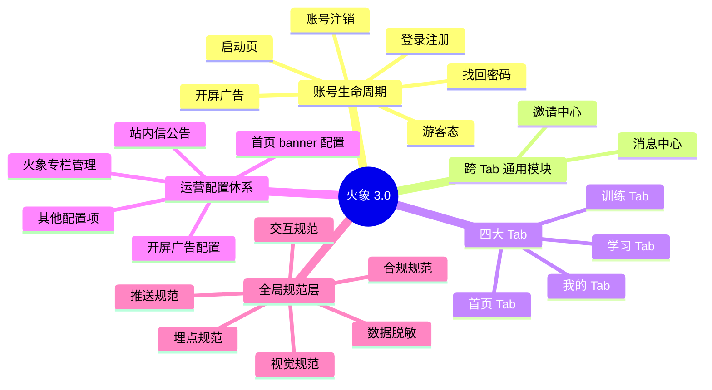

# 火象 3.0 产品需求文档（PRD）

| 项目 | 内容 |
|---|---|
| 产品名称 | 火象（Huoxiang / Huosiang）3.0 |
| 文档版本 | v1.0 |
| 文档类型 | 顶层概览（详细模块见 `modules/` 子目录） |
| 目标平台 | iOS、华为应用市场、小米应用商店、vivo 应用商店、OPPO 应用商店 |
| 发版策略 | 强制更新，AppID 不变 |
| 计划上线 | 2026-05-30 |
| 编写人 | Ray（产品） |

---

## 文档说明

本 PRD 采用**模块化文档结构**，本文件仅作为产品顶层概览。每个具体页面 / 功能的详细需求位于 `modules/` 子目录下的独立文档。

### 文档使用方式

- **产品 / 设计 / 评审**：先读本文件了解整体架构，再按需进入具体模块文档
- **开发**：按分配的模块直接读对应子目录文档
- **Claude Code**：读取目标模块文档时，建议同时加载本文件和 `99-全局规范/` 作为上下文

### 标记规范

- **[待补充]**：当前阶段大致逻辑已确定、详细规则待后续补全，不影响整体架构判断与开发评估
- **[沿用 2.0]**：该模块在 3.0 中无重大调整，主体设计沿用既有方案。本文档基于通用产品经验与合规要求补出完整描述，与 2.0 实际细节如有出入需后续核对修订

### 流程图说明

文档中流程图、状态图采用 Mermaid 语法。**导入飞书云文档后，需手动通过"文本绘图"小组件粘贴渲染**（飞书原生 Markdown 导入不会自动渲染 Mermaid 代码块）。VS Code、Typora、Obsidian、GitHub 等工具直接渲染。

---

## 1. 产品定位

火象是一款"金融教育 + 任务驱动成长"的移动端产品，面向有金融知识学习与实操训练需求的用户群体。

核心价值主张：通过"模拟账户 + 实训账户"双账户体系，结合任务驱动的成长机制（XP 经验值 + 等级），帮助用户在零门槛环境下进行交易实操训练，并获取学习课程、补贴金等回报。

产品强调"教育属性"，**不提供市场行情数据，不在 App 内承载交易界面**。所有实际交易行为通过外部 WebTrader（浏览器端交易系统）进行，App 内通过自动登录 token 进行衔接。

---

## 2. 3.0 重做的核心动因

1. **合规需要**：2.0 版本在主流广告平台投放过程中触发了合规违规，导致广告投放被限流。3.0 必须从产品形态、运营文案、合规元素等多方面重构，达到广告平台与应用市场审核标准。
2. **架构梳理**：2.0 在功能堆叠后产生了多处架构不清、模块归属混乱的问题，3.0 重新梳理整体架构。
3. **核心机制重构**：等级、任务、邀请、奖励等核心机制全面调整，明确"教育 + 成长 + 邀请裂变"的产品逻辑。

---

## 3. 整体架构

火象 3.0 采用 **4 Tab 主架构**，外加跨 Tab 通用模块、运营配置体系、全局规范层。

---

## 4. 核心架构决策（不可调整）

以下为产品架构层的核心决策，全文档基于这些前提撰写：

1. **不在 App 内承载市场行情、交易界面**：所有交易行为通过外部 WebTrader，使用自动登录 token 衔接。
2. **4 Tab 不增不减**：首页 / 训练 / 学习 / 我的。
3. **双账户体系**：模拟账户 + 实训账户，独立管理，独立用于不同任务。
4. **四条独立奖励流**：
   - XP（经验值，用于等级升级判定）
   - 积分（用于积分商城兑换）
   - 现金奖励（来自现金挑战，运营审核后打款支付宝）
   - 补贴金（来自实训账户盈利分成，月度自动结算）
   - 四者独立计算、独立展示、独立入口，不混合
5. **任务三类、全局互斥**：日常任务（模拟账户）/ 实训任务（实训账户）/ 现金挑战（实训账户）。任意时刻用户只能进行 1 个任务
6. **等级升级双判定**：等级升级 = XP 阈值达成 + 邀请条件达成。仅满足 XP 不会自动升级
7. **邀请关系建立**：通过 H5 注册路径，后端打标签建立邀请关系，不使用邀请码
8. **课程付费模式（V1）**：免费课在 App 内观看；付费课跳转小鹅通，不在 App 内承载付费课内容与交易
9. **课程播放器**：接入阿里云视频播放服务
10. **强制更新机制**：3.0 上线后强制 2.x 用户升级，AppID 不变

---

## 5. 用户群体

| 用户类型 | 描述 | 核心需求 |
|---|---|---|
| 新用户（注册引导期） | 首次接触火象，未做任务、未升级 | 快速理解产品，开始第一个任务 |
| 学习导向用户 | 重点关注金融教育、课程内容 | 学习课程、获取证书、参与人才计划 |
| 实操导向用户 | 重点关注模拟与实训交易、获取补贴金 | 完成任务、升级、获取实训账户 |
| 拉新导向用户 | 重点关注邀请、解锁现金挑战 | 邀请好友、获得现金奖励 |

---

## 6. 模块导航

### 6.1 账号生命周期

| 文档 | 说明 |
|---|---|
| [01-启动页](./modules/01-账号生命周期/01-启动页.md) | App 启动流程、视觉、隐私弹窗、强制更新 |
| [02-开屏广告](./modules/01-账号生命周期/02-开屏广告.md) | 开屏广告展示规则、跳过、跳转 |
| [03-登录弹窗](./modules/01-账号生命周期/03-登录弹窗.md) | 登录弹窗（一键登录 / 短信 / 密码三态切换） |
| [04-注册流程](./modules/01-账号生命周期/04-注册流程.md) | 隐式注册、邀请关系建立 |
| [05-找回密码](./modules/01-账号生命周期/05-找回密码.md) | 找回密码流程、强制重新登录 |
| [06-账号注销](./modules/01-账号生命周期/06-账号注销.md) | 账号注销流程、冷却期、合规要求 |
| 07-游客态规范 [待输出] | 游客态权限矩阵、登录引导 |

### 6.2 跨 Tab 通用模块

| 文档 | 说明 |
|---|---|
| [01-消息中心](./modules/02-跨Tab通用/01-消息中心.md) | 站内信列表、详情、未读管理 |
| [02-邀请中心](./modules/02-跨Tab通用/02-邀请中心.md) | 邀请中心结构、海报、归属规则 |

### 6.3 四大 Tab

| 文档 | 说明 |
|---|---|
| [03-首页 Tab](./modules/03-首页Tab/01-首页主页面.md) - 主页面 | 首页结构、banner、等级简卡、实训账户简卡、快捷入口 |
| [03-首页 Tab](./modules/03-首页Tab/02-火象专栏.md) - 火象专栏 | 文章列表、瀑布流、置顶规则 |
| [03-首页 Tab](./modules/03-首页Tab/03-文章详情页.md) - 文章详情 | 文章详情页、阿里云视频播放、点赞分享 |
| [04-训练 Tab](./modules/04-训练Tab/01-训练主页面.md) - 主页面 | 训练页 7 大区域、互斥规则、训练按钮 |
| [04-训练 Tab](./modules/04-训练Tab/02-成长模块.md) - 成长模块 | 等级展示、CTA 状态机、邀请引导 |
| [04-训练 Tab](./modules/04-训练Tab/03-等级详情页.md) - 等级详情 | 3D 椭圆轨道、等级对比、任务列表 |
| [04-训练 Tab](./modules/04-训练Tab/04-任务详情半框.md) - 任务详情 | 半框弹窗、互斥提示 |
| [04-训练 Tab](./modules/04-训练Tab/05-训练历史.md) - 训练历史 | 历史列表、状态筛选 |
| [04-训练 Tab](./modules/04-训练Tab/06-推荐任务列表.md) - 推荐任务 | 推荐任务完整列表 |
| [04-训练 Tab](./modules/04-训练Tab/07-现金奖励中心.md) - 现金奖励 | 时间轴、15 个挑战、奖金流水 |
| [04-训练 Tab](./modules/04-训练Tab/08-补贴金中心.md) - 补贴金 | 占位 + 大致逻辑 |
| [04-训练 Tab](./modules/04-训练Tab/09-账户详情页.md) - 账户详情 | 模拟账户 + 实训账户独立详情页 |
| [04-训练 Tab](./modules/04-训练Tab/10-WebTrader中转.md) - WebTrader 中转 | 跳转流程、token 协议、账户判定 |
| 文档 | 说明 |
|---|---|
| [05-学习 Tab](./modules/05-学习Tab/01-学习主页面.md) - 主页面 | 学习页 3 区块结构、6 主题分类、直播、付费课 |
| [05-学习 Tab](./modules/05-学习Tab/02-免费课程分类列表.md) - 免费课分类 | 6 主题课程列表 |
| [05-学习 Tab](./modules/05-学习Tab/03-课程详情页(免费课).md) - 课程详情（免费）| 课程介绍、章节、立即学习 |
| [05-学习 Tab](./modules/05-学习Tab/04-付费课程列表.md) - 付费课列表 | 直升 / 进阶 / 重训三 Tab |
| [05-学习 Tab](./modules/05-学习Tab/05-付费课程详情页.md) - 付费课详情 | 课程介绍、价格、优惠券、立即购买 |
| [05-学习 Tab](./modules/05-学习Tab/06-课程播放页.md) - 课程播放 | 阿里云播放器、章节切换、学习进度 |
| [05-学习 Tab](./modules/05-学习Tab/07-购买与订单.md) - 购买与订单 | 支付页、订单详情、退款流程 |
| [05-学习 Tab](./modules/05-学习Tab/08-个人学习中心.md) - 学习中心 | 已购、学习记录、订单、优惠券 |
| [05-学习 Tab](./modules/05-学习Tab/09-直播模块.md) - 直播 | 直播卡片、列表、跳小鹅通 |
| [06-我的 Tab](./modules/06-我的Tab/01-我的主页面.md) - 主页面 | 头部信息、资产数据卡、业务入口网格、设置列表 |
| [06-我的 Tab](./modules/06-我的Tab/02-账号设置.md) - 账号设置 | 修改密码、注销、退出登录 |
| [06-我的 Tab](./modules/06-我的Tab/03-实名认证.md) - 实名认证 | 实名流程、4 状态展示、合规要求 |
| [06-我的 Tab](./modules/06-我的Tab/04-积分商城.md) - 积分商城 | 积分明细、兑换流程、兑换记录 |
| [06-我的 Tab](./modules/06-我的Tab/05-活动中心.md) - 活动中心 | 活动列表、3 Tab 状态、跳转配置 |
| [06-我的 Tab](./modules/06-我的Tab/06-帮助与反馈.md) - 帮助与反馈 | 在线客服、意见反馈表单 |
| [06-我的 Tab](./modules/06-我的Tab/07-关于我们.md) - 关于我们 | 版本检查、协议、SDK 说明、备案 |

### 6.4 运营配置体系

| 文档 | 说明 |
|---|---|
| [00-总览](./modules/98-运营配置体系/00-总览.md) | App 内所有需要后台配置的位置清单 |
| [01-开屏广告配置](./modules/98-运营配置体系/01-开屏广告配置.md) | 开屏广告后台配置项 |
| 其他配置项 [待输出] | 首页 banner、火象专栏、推荐任务等 |

### 6.5 全局规范

| 文档 | 说明 |
|---|---|
| [01-视觉规范](./modules/99-全局规范/01-视觉规范.md) | 色彩、字体、字号、间距、按钮、弹窗、图标 |
| 02-交互规范 [待输出] | 弹窗、Toast、加载、空状态、错误态 |
| 03-数据脱敏 [待输出] | 全局脱敏规则 |
| 04-推送规范 [待输出] | 推送策略 |
| 05-合规规范 [待输出] | 协议、隐私、合规元素 |

---

## 7. 文档维护

- 文档变更记录见各模块文档底部
- 顶层 PRD 修订需评审
- 模块文档修订由各模块负责人维护

---
