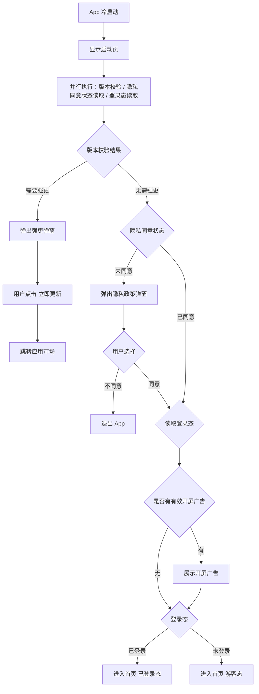

# 01-启动页

| 字段 | 内容 |
|---|---|
| 模块名称 | 启动页 |
| 业务归属 | 账号生命周期 |
| 入口路径 | App 启动（每次冷启动） |
| 页面层级 | 一级（特殊：启动） |
| 关联文档 | [02-开屏广告](./02-开屏广告.md)、[98-01-开屏广告配置](../98-运营配置体系/01-开屏广告配置.md) |
| 版本 | v1.0 |
| 最后更新 | 2026-04-30 |

---

## 1. 页面定位

启动页（Splash）是用户每次冷启动 App 时看到的第一个页面，承担三项职责：

1. **品牌曝光**：展示火象 Logo 与品牌 Slogan
2. **必要校验**：完成版本号校验、隐私政策同意状态校验、登录态校验
3. **流程衔接**：根据校验结果将用户引导至下一步（强更弹窗 / 隐私政策弹窗 / 开屏广告 / 主页）

启动页**不可跳过**，但显示时长有上限，避免用户等待过久。

---

## 2. 入口与跳转

### 入口

- 用户每次冷启动 App（双击主屏图标、从其他 App 切回时若 App 已被系统杀死、首次安装打开）

### 出口（按校验结果分支）

| 出口 | 触发条件 |
|---|---|
| 强更弹窗 | 当前版本低于服务端最低支持版本 |
| 隐私政策弹窗 | 用户从未同意 / 隐私政策版本更新需重新同意 |
| 退出 App | 用户在隐私弹窗点击"不同意" |
| 开屏广告页 | 隐私已同意，且后台有有效开屏广告配置 |
| 首页（已登录态） | 隐私已同意，已登录，无开屏广告 |
| 首页（游客态） | 隐私已同意，未登录，无开屏广告 |

---

## 3. 页面结构

### 3.1 布局

启动页为全屏单页面，居中布局。

| 区域 | 元素 | 说明 |
|---|---|---|
| 顶部安全区 | 状态栏 | 状态栏图标白/深色由背景适配，建议主图采用深色背景配白色状态栏 |
| 主体居中区 | Logo | 火象品牌 Logo |
| 主体居中区 | Slogan | 品牌 Slogan 文字 |
| 底部 | 留白 | 不展示版本号、不展示按钮 |

### 3.2 视觉元素

| 元素 | 内容 |
|---|---|
| 背景 | 全屏背景（图片或纯色）**[待 UI 提供]** |
| Logo | 火象品牌 Logo（已有素材） |
| Slogan | 品牌 Slogan 文案 **[待运营/品牌方提供]**，需通过合规审核 |
| 跳过按钮 | 不提供 |
| 加载动画 | 可选；若校验耗时较长可显示极小的加载提示 |

### 3.3 显示时长

| 场景 | 时长 |
|---|---|
| 默认显示 | 1.5 秒 |
| 校验流程耗时较长 | 最长不超过 3 秒 |
| 超时强制进入下一步 | 3 秒后无论校验是否完成，强制进入流程下一节点 |

> 校验若失败（如服务端无响应），按"无需强更、隐私已同意、登录态以本地缓存为准"的兜底策略继续流程，不阻塞用户。

---

## 4. 启动流程

### 4.1 流程图

### 4.2 校验逻辑

启动页期间需要并行完成以下校验：

| 校验项 | 数据来源 | 失败兜底 |
|---|---|---|
| 版本号校验 | 服务端接口返回最低支持版本 | 接口失败时不强更，按当前版本继续 |
| 隐私同意状态 | 本地存储（含同意的隐私版本号） | 无本地记录 = 未同意 |
| 登录态 | 本地 token + 服务端校验 token 有效性 | token 无效 = 未登录 |
| 开屏广告配置 | 服务端配置接口 | 接口失败 / 无配置 = 不展示开屏广告 |

---

## 5. 关键交互

### 5.1 强制更新弹窗

**触发条件**：当前 App 版本号低于服务端配置的最低支持版本。

**弹窗结构**：

| 元素 | 内容 |
|---|---|
| 弹窗形式 | 模态弹窗，居中显示，背景遮罩不可点击关闭 |
| 标题 | 发现新版本 |
| 主图（可选） | 更新引导插画 **[待 UI 提供]** |
| 内容 | 火象已发布新版本 [服务端返回的版本号]，请更新后继续使用。 更新内容：[服务端返回的更新文案] |
| 按钮 | 仅"立即更新"一个按钮，无关闭、无取消 |

**交互规则**：
- 不可点击外部区域关闭
- 不可使用系统返回手势 / 物理返回键关闭
- 用户点击"立即更新"按设备识别跳转：
  - iOS → App Store 火象详情页
  - Android → 按厂商识别（华为 / 小米 / vivo / OPPO）跳对应应用市场
- 用户在应用市场未完成下载、退出市场后再次进入 App，强更弹窗仍弹出

### 5.2 隐私政策弹窗

**触发条件**：
- 用户从未同意（首次安装首次启动）
- 服务端配置的隐私政策版本号高于本地已同意的版本号（隐私政策更新需重新同意）

**弹窗结构**：

| 元素 | 内容 |
|---|---|
| 弹窗形式 | 模态弹窗，背景遮罩不可点击关闭 |
| 标题 | 用户协议与隐私政策 |
| 正文 | 标准合规告知文案，包含数据收集范围、使用目的、第三方共享、用户权利等说明 **[详细文案待合规提供]** |
| 协议链接 | "用户协议"、"隐私政策" 两个可点击链接，点击跳转协议详情页（H5 或内部页） |
| 按钮 | "同意并继续"（主按钮）、"不同意并退出"（次按钮） |

**交互规则**：
- 用户点击"同意并继续"：
  - 本地存储记录"已同意"标识 + 当前隐私版本号
  - 关闭弹窗，继续启动流程
- 用户点击"不同意并退出"：
  - 弹出二次确认（"不同意将无法使用 App，确定退出吗？"）**[待对齐]** 是否需要二次确认
  - 确认后退出 App
- 隐私政策版本更新时强制重新弹出

---

## 6. 异常态

| 异常 | 表现 | 处理 |
|---|---|---|
| 网络断开 | 无法完成版本校验 / 登录态校验 | 启动页超时 3 秒后按本地缓存继续，登录态以本地为准；进入首页后由各页面自行处理网络异常 |
| 版本校验接口超时 | 启动页停留时间过长 | 3 秒强制进入下一步，按"无需强更"处理 |
| 服务端配置错误（如返回非法版本号） | 校验逻辑无法执行 | 按"无需强更"处理，记录错误日志 |
| 本地存储被清除 | 隐私同意状态丢失 | 视为未同意，重新弹出隐私弹窗 |
| 应用市场跳转失败 | 强更弹窗"立即更新"按钮无响应 | 提示用户手动前往应用市场更新；保留弹窗 |

---

## 7. 接口约束

启动页所需的服务端能力：

| 能力 | 说明 |
|---|---|
| 获取最低支持版本 | 返回当前最低支持的 App 版本号 + 强更文案 |
| 获取隐私政策版本号 | 返回当前生效的隐私政策版本号（与本地比对决定是否重新弹窗） |
| Token 有效性校验 | 校验本地 token 是否仍有效，无效则视为未登录 |
| 获取开屏广告配置 | 返回当前生效的开屏广告（图片、跳转、跳过按钮、显示时长等） |

> 接口的具体定义、字段、协议由后端开发设计，本文档仅描述业务诉求。

