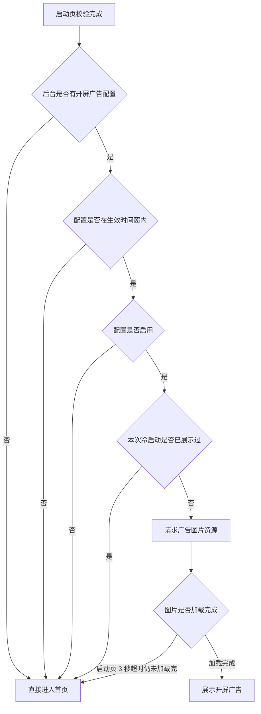
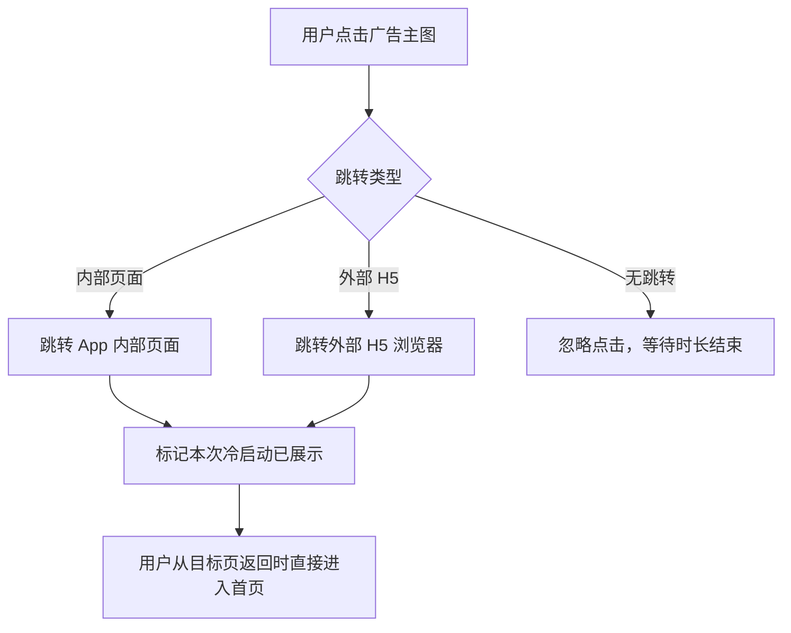

# 02-开屏广告

| 字段 | 内容 |
|---|---|
| 模块名称 | 开屏广告 |
| 业务归属 | 账号生命周期 |
| 入口路径 | App 冷启动 → 启动页 → 开屏广告 → 首页 |
| 页面层级 | 一级（特殊：启动流程） |
| 关联文档 | [01-启动页](./01-启动页.md)、[98-01-开屏广告配置](../98-运营配置体系/01-开屏广告配置.md) |
| 版本 | v1.0 |
| 最后更新 | 2026-04-30 |

---

## 1. 页面定位

开屏广告是用户每次冷启动 App 后、进入主页面前展示的全屏广告位。承担两项职责：

1. **运营推广**：承载活动、课程、新功能等推广内容
2. **品牌曝光**：在用户停留的几秒内强化品牌印象

开屏广告**由运营后台配置**，可以全局开启或关闭。**没有有效配置时，启动页直接进入主页面，不展示开屏广告**。

---

## 2. 入口与跳转

### 入口

- 用户冷启动 App，启动页校验完成后
- 后台有有效的开屏广告配置（在生效时间窗内、未关闭、图片可加载）

### 出口

| 出口 | 触发条件 |
|---|---|
| 跳转目标页 | 用户点击广告主体（取决于配置的跳转类型） |
| 首页 | 用户点击"跳过"按钮 |
| 首页 | 显示时长结束自动跳转 |

---

## 3. 页面结构

### 3.1 布局

| 区域 | 元素 | 说明 |
|---|---|---|
| 全屏区域 | 广告主图 | 由后台配置的图片资源 |
| 右上角 | 跳过按钮 + 倒计时 | 必须显示，遵循合规要求 |

### 3.2 视觉元素

| 元素 | 规则 |
|---|---|
| 广告主图 | 全屏展示，按设备屏幕比例适配。图片尺寸规范见 [98-01-开屏广告配置](../98-运营配置体系/01-开屏广告配置.md) |
| 跳过按钮 | 固定显示在右上角安全区内，文案"跳过 X"或"跳过 \| X 秒"（X 为剩余倒计时秒数） |
| 倒计时 | 跳过按钮内联展示倒计时数字，每秒更新 |
| 广告标识 | 不显示"广告"标识 |
| 摇一摇 | 不启用摇一摇跳转 |

### 3.3 显示时长

| 配置项 | 默认值 | 范围 |
|---|---|---|
| 显示时长 | 3 秒 | 3-5 秒（由后台配置） |

时长结束自动进入首页。用户可主动点击"跳过"提前结束。

---

## 4. 展示规则

### 4.1 触发条件

### 4.2 频次规则

| 场景 | 是否展示 |
|---|---|
| 用户每次冷启动 App | 展示一次 |
| 用户从前台切到后台再切回（App 未被系统杀死） | 不展示 |
| 用户点击广告跳转目标页后返回 App | 不展示，直接进入首页 |
| 用户点击"跳过"后再次冷启动 | 重新展示（如配置仍在生效期内） |

> "冷启动"定义：App 进程被系统/用户杀死后重新启动。前后台切换不属于冷启动。

### 4.3 用户类型

- 已登录用户和游客态用户**均展示**开屏广告
- 不区分用户类型差异化下发（V1 不做用户分群）

### 4.4 同时多个广告生效时

| 规则 | 说明 |
|---|---|
| 优先级 | 按后台配置的优先级降序选择 |
| 同优先级 | 按配置创建时间倒序选择最新一条 |
| 单次启动 | 仅展示 1 条，不轮播多条 |

---

## 5. 关键交互

### 5.1 用户点击广告主体

**跳转规则**：
- 跳转内部页面时，按目标类型路由（活动详情 / 课程详情 / 等级详情等）
- 跳转外部 H5 时，使用系统浏览器或 WebView **[待对齐]**
- 用户点击后，本次冷启动周期内不再展示开屏广告，从目标页返回直接进入首页

### 5.2 用户点击跳过按钮

- 立即关闭开屏广告
- 进入首页
- 本次冷启动周期内不再展示

### 5.3 显示时长结束

- 自动关闭开屏广告
- 进入首页
- 本次冷启动周期内不再展示

### 5.4 网络/资源异常

| 场景 | 处理 |
|---|---|
| 图片资源加载缓慢，启动页 3 秒倒计时已超时 | 不展示开屏广告，直接进入首页（不做兜底白屏） |
| 配置接口请求失败 | 不展示开屏广告，直接进入首页 |
| 广告图片下载失败 | 不展示开屏广告，直接进入首页 |
| 跳转目标无效（如活动已下线） | 跳转目标页后由目标页自行处理状态展示（如显示"活动已结束"） |

---

## 6. 异常态

| 异常 | 表现 | 处理 |
|---|---|---|
| 图片下载失败 / 超时 | 不展示广告 | 直接进入首页，记录失败日志 |
| 配置接口失败 | 无法获取广告配置 | 不展示广告，直接进入首页 |
| 跳转目标无效 | 用户点击后看到目标页报错 | 由目标页自行兜底（如活动已结束页） |
| 后台手动下线广告（用户已开始展示） | 已展示中的广告继续显示完毕 | 下次冷启动按新配置生效 |

---

## 7. 合规要求

| 要求 | 说明 |
|---|---|
| 跳过按钮 | 必须提供，且明显可见、可点击 |
| 倒计时 | 必须显示剩余时长 |
| 广告标识 | 本产品的开屏广告**不显示"广告"标识**（运营定位为"推广位"，详见配置体系备注） |
| 摇一摇跳转 | 不启用 |
| 误触防护 | 点击广告主体跳转必须为用户明确点击，不允许滑动、晃动等被动触发 |

> 合规细节如有变化（如应用市场审核要求增强），需配套调整。

---

## 8. 接口约束

| 能力 | 说明 |
|---|---|
| 获取开屏广告配置 | 启动页校验阶段调用，返回当前生效的广告配置（图片 URL、跳转类型、跳转目标、显示时长、跳过按钮配置等） |
| 广告资源 CDN | 图片通过 CDN 下发，需要保证全国稳定 |

