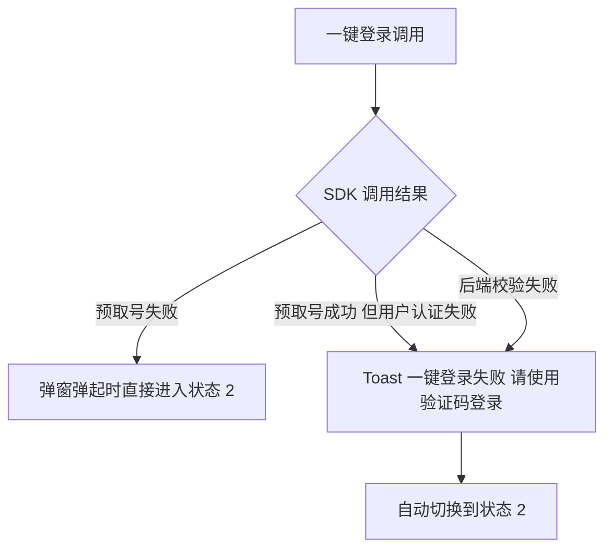
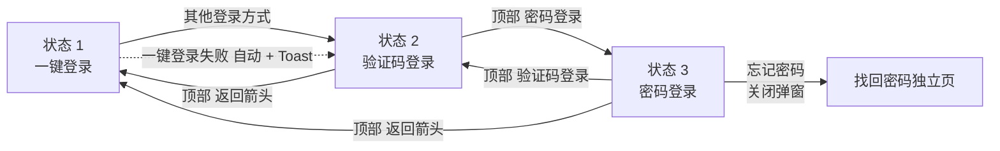

# 03-登录弹窗

| 字段 | 内容 |
|---|---|
| 模块名称 | 登录弹窗 |
| 业务归属 | 账号生命周期 |
| 入口路径 | 启动页（未登录态进入首页前可触发）/ 游客态触发登录 / 主动退出登录后 / token 失效拦截 |
| 页面层级 | 全局弹窗（半屏 Bottom Sheet） |
| 关联文档 | [04-注册流程](./04-注册流程.md)、[05-找回密码](./05-找回密码.md) |
| 版本 | v2.0 |
| 最后更新 | 2026-05-06 |

---

## 1. 模块定位

火象 3.0 的登录不是独立页面，而是一个**全局底部弹窗（Bottom Sheet）**。从任意页面触发登录时，从底部弹起这个弹窗。

弹窗内有 3 种内部状态，状态间通过弹窗内部切换（**不重新拉起新弹窗**）：

| 状态 | 描述 | 进入方式 |
|---|---|---|
| 状态 1：一键登录（默认） | 本机号码 + 一键登录按钮 | 弹窗弹起时默认状态 |
| 状态 2：验证码登录 | 手机号 + 验证码 | 一键登录失败自动切入 / 用户点击"其他登录方式" |
| 状态 3：密码登录 | 手机号 + 密码 | 状态 2 顶部右侧小按钮 |

V1 仅支持手机号体系登录，**不接入微信 / Apple / 华为等第三方账号登录**。

---

## 2. 入口与跳转

### 入口

| 入口 | 触发条件 |
|---|---|
| 启动页校验后 | 未登录态用户首次访问需登录功能 |
| 游客态 | 游客点击需要登录的功能（如训练 Tab、我的 Tab、消息、邀请） |
| 我的 Tab → 退出登录 | 用户主动退出后再次访问需登录功能时 |
| token 失效 | 后端返回 token 失效错误码时全局拦截弹起 |

### 出口

| 出口 | 触发条件 |
|---|---|
| 关闭弹窗，留在原页面 | 用户主动关闭（× / 下拉 / 点击遮罩） |
| 关闭弹窗，进入登录后流程 | 任意方式登录成功 |
| 跳转找回密码独立页面 | 在密码登录状态点击"忘记密码" |

### 关键设计

- **关闭弹窗 = 取消登录**：原页面状态保留（如游客态触发，回到游客态原页面）
- **登录成功 = 关闭弹窗 + 维持原页面或跳转**：根据触发场景决定
  - 从启动页触发：登录后进入首页
  - 从游客态某页面触发：登录后留在该页面，刷新该页面登录态
  - 从 token 失效拦截：登录后留在原页面，重试失败的操作

---

## 3. 弹窗规格

| 项 | 值 |
|---|---|
| 弹窗类型 | 底部弹窗（Bottom Sheet） |
| 高度 | 屏幕高度 60%（不同状态可微调） |
| 圆角 | 顶部圆角 16px |
| 遮罩 | `#000000` 50% 透明度 |
| 关闭方式 | 顶部 × 按钮 / 下拉手势 / 点击遮罩 |
| 出现动画 | 从底部滑入 |
| 状态切换动画 | 内部状态切换使用淡入淡出 |

---

## 4. 状态 1：一键登录（默认）

### 4.1 页面结构

| 区域 | 内容 |
|---|---|
| 顶部 | × 关闭按钮（左上角） |
| 品牌区 | 火象 Logo + 欢迎文案 |
| 号码展示卡 | 由运营商 SDK 返回的脱敏号码 + 运营商名称（如 "180****3660"、"中国移动提供认证服务"） |
| 主按钮 | "本机号码一键登录"（高度 48px，主色 `#E72737`） |
| 协议勾选 | 复选框 + 协议文本（详见 4.2） |
| 文字按钮 | 底部"其他登录方式" |

### 4.2 协议勾选文案

```
☐ 已阅读并同意《用户协议》《隐私政策》《中国移动认证服务条款》
```

**说明**：

- 协议名称为可点击链接，点击跳转协议详情
- "中国移动" 按 SDK 实际返回的运营商名称展示（中国移动 / 中国联通 / 中国电信）
- 三个协议合并成一行勾选项
- 默认未勾选

### 4.3 协议未勾选的交互

| 状态 | 主按钮表现 |
|---|---|
| 未勾选 | 主按钮置灰，可点击但触发提示 |
| 已勾选 | 主按钮高亮可点击 |

未勾选时点击主按钮：

- 弹出 Toast"请先阅读并同意协议"
- 协议勾选区域抖动一次以引起注意

### 4.4 一键登录交互

| 步骤 | 行为 |
|---|---|
| 弹窗打开时 | 调用一键登录 SDK 预取号 |
| SDK 返回脱敏号码 | 状态 1 卡片展示 |
| 用户勾选协议 | 主按钮变为可点击 |
| 用户点击主按钮 | App 内静默调用 SDK 完成认证（不跳转外部页面） |
| 后端校验通过 | 关闭弹窗，进入登录后流程 |

> **注意**：一键登录的整个认证过程**不展示运营商授权全屏页**。SDK 在内部处理认证逻辑，用户感知是直接登录成功（前提是用户已在状态 1 卡片上勾选了协议）。

---

## 5. 状态 2：验证码登录

### 5.1 进入方式

- 一键登录失败时**自动切入**（详见 5.6）
- 用户主动点击状态 1 底部"其他登录方式"

### 5.2 页面结构

| 区域 | 内容 |
|---|---|
| 顶部左侧 | ← 返回按钮（回到状态 1） |
| 顶部右侧 | "密码登录"（文字按钮，切换到状态 3） |
| 手机号输入框 | 占位符"请输入手机号"，限制 11 位数字 |
| 验证码输入框 | 占位符"请输入验证码"，限制 6 位数字 |
| 验证码按钮 | "获取验证码"（手机号格式正确时可点击，倒计时期间显示"60s 后重发"） |
| 主按钮 | "登录"（高度 48px，主色） |
| 协议勾选 | 同状态 1 |

### 5.3 输入字段规则

| 字段 | 规则 |
|---|---|
| 手机号 | 11 位中国大陆手机号，必须以 1 开头，第二位 3-9 |
| 短信验证码 | 6 位数字 |

### 5.4 验证码发送规则

| 项 | 规则 |
|---|---|
| 验证码位数 | 6 位数字 |
| 有效期 | 5 分钟 |
| 重发冷却 | 60 秒 |
| 单手机号单日发送上限 | 5 条 |
| 达上限处理 | 锁定 1 小时不可发送，提示"今日发送次数已达上限，请稍后再试" |

### 5.5 操作流程

1. 用户输入手机号
2. 手机号格式正确后"获取验证码"按钮变为可点击
3. 用户点击"获取验证码"，倒计时 60 秒
4. 用户输入验证码
5. 勾选协议后点击"登录"
6. 后端校验：
   - 手机号已注册 → 直接登录
   - 手机号未注册 → 自动注册并登录（详见 [04-注册流程](./04-注册流程.md)）

### 5.6 一键登录失败的自动切入



**Toast 文案**：

- 默认："一键登录失败，请使用验证码登录"
- 持续 2 秒后自动消失
- 同时弹窗内容已切换到状态 2

---

## 6. 状态 3：密码登录

### 6.1 进入方式

- 仅通过状态 2 顶部右侧"密码登录"按钮进入

### 6.2 页面结构

| 区域 | 内容 |
|---|---|
| 顶部左侧 | ← 返回按钮（回到状态 1） |
| 顶部右侧 | "验证码登录"（文字按钮，切回状态 2） |
| 手机号输入框 | 占位符"请输入手机号" |
| 密码输入框 | 占位符"请输入密码"，可见切换图标 |
| 辅助文字 | "忘记密码？"（右下角文字按钮） |
| 主按钮 | "登录" |
| 协议勾选 | 同状态 1 |

### 6.3 输入字段规则

| 字段 | 规则 |
|---|---|
| 手机号 | 11 位中国大陆手机号 |
| 密码 | 8-20 位，必须包含字母和数字 |

### 6.4 操作流程

1. 用户输入手机号和密码
2. 勾选协议后点击"登录"
3. 后端校验：
   - 手机号未注册 → Dialog 提示"该手机号未注册"，按钮"立即注册"切换到状态 2
   - 手机号已注册、密码错误 → 提示"密码错误，请重新输入或找回密码"
   - 手机号已注册、密码正确 → 登录成功

### 6.5 密码错误次数限制

| 项 | 规则 |
|---|---|
| 单手机号单日错误次数 | 5 次 |
| 达上限处理 | 锁定 1 小时不可使用密码登录 |
| 锁定期间 | 用户仍可使用一键登录 / 验证码登录 |

### 6.6 找回密码跳转

点击"忘记密码"：

1. **关闭登录弹窗**
2. 跳转到独立的"找回密码"页面（详见 [05-找回密码](./05-找回密码.md)）
3. 找回密码完成后跳转回登录页面（独立全屏页，不再回到弹窗）
4. 用户在登录页用新密码登录

---

## 7. 状态切换交互

### 7.1 状态切换路径



### 7.2 状态切换的数据保留

| 数据 | 状态切换时是否保留 |
|---|---|
| 手机号 | **保留**（状态 2 ↔ 状态 3 切换时） |
| 验证码 | 不保留 |
| 密码 | 不保留 |
| 协议勾选状态 | 保留 |

> **关键设计**：用户在状态 2 输入了手机号但希望改用密码登录，切到状态 3 时手机号自动填充，不需要重新输入。

### 7.3 弹窗内的高度自适应

不同状态下内容高度略有差异：

| 状态 | 推荐高度 |
|---|---|
| 状态 1：一键登录 | 屏幕高度 50% |
| 状态 2：验证码登录 | 屏幕高度 60% |
| 状态 3：密码登录 | 屏幕高度 55% |

切换时高度平滑过渡。

---

## 8. 关键交互

### 8.1 输入字段实时校验

| 字段 | 校验规则 |
|---|---|
| 手机号 | 输入完成 11 位时校验格式，不合规则在输入框下方红色提示 |
| 验证码 | 仅允许输入数字，自动限制 6 位 |
| 密码 | 输入时不实时校验，仅在点击登录时校验 |

### 8.2 验证码倒计时

- 点击"获取验证码"后，按钮变为"60s 后重发"，60 秒倒计时
- 倒计时期间按钮置灰
- 倒计时结束后按钮恢复"重新获取"

### 8.3 关闭弹窗的处理

用户通过 × / 下拉 / 点击遮罩关闭弹窗：

| 触发场景 | 关闭后行为 |
|---|---|
| 启动页强制弹起 | 关闭后留在启动页（用户可继续游客态浏览） |
| 游客态某页面触发 | 关闭后留在该页面，保持游客态 |
| token 失效拦截弹起 | 关闭后留在原页面，原操作未完成 |

---

## 9. 异常态

| 异常 | 表现 | 处理 |
|---|---|---|
| 一键登录 SDK 加载失败 | 弹窗弹起时检测 | 直接进入状态 2（验证码登录） |
| 一键登录调用失败 | 用户点击主按钮后失败 | Toast 提示 + 自动切换到状态 2 |
| 网络不可用 | 接口请求失败 | 弹出 Toast"网络异常，请检查网络后重试" |
| 后端服务不可用 | 接口超时 / 5xx | 弹出 Toast"服务异常，请稍后再试" |
| 短信下发失败 | 用户长时间收不到验证码 | 60 秒后允许重发；可显示"收不到验证码？"帮助提示 |
| 账号被风控锁定 | 后端返回风控错误码 | 提示"账号存在风险，请联系客服" + 客服入口 |
| 验证码错误 | 后端返回错误 | 输入框下方红色提示"验证码错误" |
| 验证码过期 | 后端返回过期错误 | 提示"验证码已过期，请重新获取" |
| 弹窗被多次触发 | 多个触发源同时调用登录 | 弹窗具备幂等性，只展示一个实例 |

---

## 10. 接口约束

| 能力 | 说明 |
|---|---|
| 一键登录预取号 | SDK 调用，获取脱敏号码用于状态 1 展示 |
| 一键登录认证 | App 内调用 SDK 完成认证，向后端提交 token 完成登录 |
| 发送短信验证码 | 调用短信网关下发验证码 |
| 短信验证码登录 | 校验验证码并返回 token；自动判定是否首次注册 |
| 密码登录 | 校验密码，返回 token；记录错误次数 |
| 用户协议版本 | 返回当前用户协议、隐私政策版本号 |

接口的具体定义、字段、协议由后端开发设计，本文档仅描述业务诉求。

---

## 11. 合规要求

| 要求 | 说明 |
|---|---|
| 协议默认未勾选 | 应用市场审核要求，不得替用户预勾选 |
| 协议链接清晰可见 | 协议名称为可点击链接，跳转协议详情页 |
| 一键登录合规 | 协议勾选项明确包含"运营商认证服务条款"，符合工信部要求 |
| 协议版本变更 | 协议版本更新后，下次登录强制重新勾选 |
| 短信防刷 | 防刷机制（设备指纹 / IP 限制）由后端实现，前端不暴露 |
