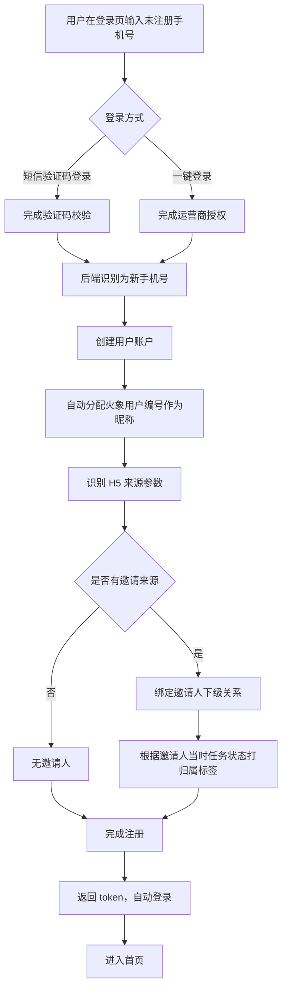

# 04-注册流程

| 字段 | 内容 |
|---|---|
| 模块名称 | 注册流程 |
| 业务归属 | 账号生命周期 |
| 入口路径 | 登录页 → 注册 / 短信登录时新手机号自动注册 / 一键登录时新手机号自动注册 |
| 页面层级 | 一级 |
| 关联文档 | [03-登录页](./03-登录页.md)、[02-跨Tab通用/02-邀请中心](../02-跨Tab通用/02-邀请中心.md) |
| 版本 | v1.0 |
| 最后更新 | 2026-05-06 |

---

## 1. 模块定位

火象 3.0 的注册流程**没有独立的注册页面**，注册行为隐式发生在登录流程中：

- 用户使用"短信验证码登录"时，若手机号未注册，**自动注册**并登录
- 用户使用"一键登录"时，若手机号未注册，**自动注册**并登录
- 用户使用"密码登录"时，若手机号未注册，提示先去注册（引导切换到短信验证码登录或一键登录）

**核心策略**：降低注册门槛，免去单独的注册步骤，新用户首次登录即完成注册。

---

## 2. 入口与跳转

### 入口

- 登录页"短信验证码登录" → 输入未注册手机号 → 点击登录
- 登录页"一键登录" → 一键登录的手机号未注册
- 登录页"密码登录" → 提示未注册时点击"立即注册"按钮，跳转到"短信验证码登录"Tab
- 通过 H5 邀请链接进入注册流程

### 出口

| 出口 | 触发条件 |
|---|---|
| 首页（已登录态）| 注册成功 |
| 登录页 | 用户中途取消注册 |

---

## 3. 注册流程

### 3.1 流程图

### 3.2 自动分配昵称规则

新用户注册成功后，系统自动分配昵称：

| 项 | 规则 |
|---|---|
| 昵称格式 | "火象用户" + 数字编号 |
| 编号规则 | 系统自增编号，确保全局唯一（如 "火象用户000001"） |
| 用户后续修改 | 用户可在"我的 → 账号设置"中自行修改 |
| 唯一性约束 | 昵称无唯一性约束（用户可修改为重复昵称） |

### 3.3 邀请关系建立

3.0 的邀请关系通过 H5 注册路径建立。

**触发时机**：用户**注册成功的瞬间**（注册接口返回成功时）。

**逻辑流程**：

1. 邀请人通过 App 内"邀请"按钮触发分享
2. 分享出去的链接为带追踪参数的 H5 注册页
3. 被邀请人点击链接进入 H5
4. H5 在用户进入时识别来源参数（包含邀请人 ID）
5. 用户从 H5 跳转到 App 注册流程时，邀请人 ID 一并传入
6. 用户完成注册后，后端识别该参数，自动建立邀请关系：
   - 在用户主表中记录"邀请人 ID"
   - 同时根据邀请人**当时正在进行的任务类型**确定归属：
     - 邀请人正在做升级任务 → 立即归"升级邀请"
     - 邀请人正在做现金任务 → 立即归"现金邀请"
     - 邀请人没接任何任务 → 暂不归类，标记为"待追溯"，等邀请人首次接任务时通过弹窗一次性归类
7. 邀请关系一经建立永久不变，**不支持修改、不支持二次绑定**

**重要约束**：

- 用户绕过 H5 直接通过应用市场下载注册 → 不建立邀请关系（无来源参数）
- 用户曾通过 H5 链接进入但未完成注册，下次直接打开 App 注册 → 不建立邀请关系（来源参数仅在 H5 跳转 App 的当次有效）
- 已注册用户再次点击 H5 链接 → 不重新建立邀请关系（注册关系已存在）

邀请归属规则、阶段判定（注册 / 领取实训 / 启动 / 付费）的详细规则见 [邀请中心](../02-跨Tab通用/02-邀请中心.md)。

---

## 4. 关键交互

### 4.1 用户在登录页选择"密码登录"输入未注册手机号

**场景**：用户输入手机号 + 密码点击登录，后端识别为未注册。

**处理**：

1. 弹出 Dialog 提示"该手机号未注册"
2. Dialog 包含两个按钮：
   - 主按钮"立即注册"：点击后切换到"短信验证码登录"Tab，手机号自动填充
   - 次按钮"取消"：关闭 Dialog 留在密码登录界面

### 4.2 H5 进入 App 时的参数传递

**场景**：被邀请人通过 H5 链接打开 App。

**处理**：

1. H5 检测设备已安装 App → 通过 deeplink 唤起 App，参数随 deeplink 传递
2. H5 检测设备未安装 App → 引导用户下载，下载完成后用户首次打开 App 时通过其他机制（如剪贴板 / 设备指纹）传递参数 **[沿用 2.0 H5 现有方案]**
3. App 启动后识别到邀请来源参数，缓存在内存中
4. 用户完成注册时一并提交参数

### 4.3 注册中途取消

用户在登录/注册过程中可随时关闭页面退出。已发送的验证码 5 分钟内有效，60 秒内不可重新发送。

---

## 5. 异常态

| 异常 | 表现 | 处理 |
|---|---|---|
| 注册接口失败 | 用户点击登录后无响应 | 弹出 Toast "注册失败，请稍后重试" |
| 邀请人 ID 无效 | H5 传递的邀请人 ID 在数据库中不存在 | 注册成功，但不建立邀请关系，不向用户提示 |
| 邀请人账号已注销 | H5 传递的邀请人已注销 | 注册成功，但不建立邀请关系 |
| 网络中途断开 | 注册接口请求失败 | 提示用户重试，已发送的验证码可继续使用 |
| 同手机号注销冷却期内重新注册 | 用户在注销后 30 天内尝试用相同手机号注册 | 提示"该手机号在注销冷却期内，请 X 天后再试或更换手机号" |

---

## 6. 接口约束

| 能力 | 说明 |
|---|---|
| 注册（合并在登录接口内） | 短信验证码登录 / 一键登录接口内部判定是否新用户，新用户自动创建账户 |
| 邀请关系绑定 | 注册时根据传入的邀请人 ID 建立关系，并打归属标签 |
| 用户编号生成 | 系统自动分配全局唯一的"火象用户编号"作为初始昵称 |
| 注销冷却校验 | 注册前校验手机号是否在 30 天冷却期内 |

接口的具体定义、字段、协议由后端开发设计，本文档仅描述业务诉求。

---

## 7. 合规要求

| 要求 | 说明 |
|---|---|
| 协议同意记录 | 用户同意的协议版本号必须落库存储 |
| 实名认证 | 注册时不强制实名；实名认证在用户使用相关功能时触发，详见我的 Tab → 实名认证 |
| 未成年人保护 | 注册流程不主动询问年龄；如运营要求增加年龄声明，需合规审核 [待对齐] |
| 防刷注册 | 同 IP / 同设备的注册频次限制由后端实现，前端不暴露 |
