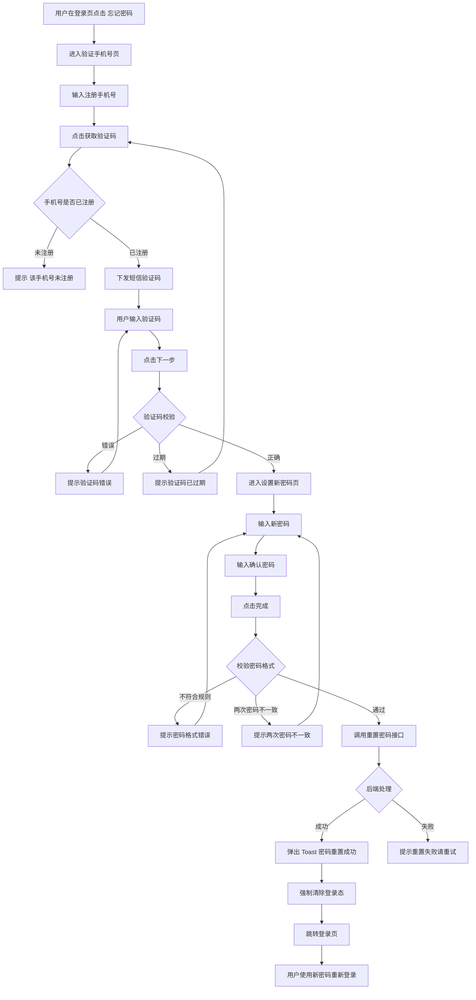

# 05-找回密码

| 字段 | 内容 |
|---|---|
| 模块名称 | 找回密码 |
| 业务归属 | 账号生命周期 |
| 入口路径 | 登录页 → 忘记密码 |
| 页面层级 | 二级 |
| 关联文档 | [03-登录页](./03-登录页.md) |
| 版本 | v1.0 |
| 最后更新 | 2026-05-06 |

---

## 1. 模块定位

找回密码模块用于已注册用户忘记密码时通过短信验证码重置新密码。

重置成功后**强制跳转登录页要求重新登录**，不直接以新密码登录。

---

## 2. 入口与跳转

### 入口

- 登录页 → "密码登录"Tab → "忘记密码" 文字按钮

### 出口

| 出口 | 触发条件 |
|---|---|
| 登录页 | 重置成功，跳转登录页要求用新密码登录 |
| 登录页 | 用户取消找回密码流程返回 |

---

## 3. 页面结构

找回密码包含 2 个页面：

### 3.1 验证手机号页

| 区域 | 元素 |
|---|---|
| 顶部 | 返回按钮 + 标题"找回密码" |
| 说明文字 | "请输入注册手机号，我们将向您发送验证码" |
| 输入区 | 手机号输入框 |
| 输入区 | 短信验证码输入框 + "获取验证码"按钮 |
| 主按钮 | "下一步"（高度 48px，主色） |

### 3.2 设置新密码页

| 区域 | 元素 |
|---|---|
| 顶部 | 返回按钮 + 标题"设置新密码" |
| 输入区 | 新密码输入框（密码可见切换图标） |
| 输入区 | 确认新密码输入框 |
| 提示 | "密码要求：8-20 位，必须包含字母和数字" |
| 主按钮 | "完成"（高度 48px，主色） |

---

## 4. 找回密码流程

---

## 5. 关键规则

### 5.1 验证码规则

与登录页的短信验证码规则一致：

| 项 | 规则 |
|---|---|
| 验证码位数 | 6 位数字 |
| 有效期 | 5 分钟 |
| 重发冷却 | 60 秒 |
| 单手机号发送上限 | 累计 5 条（与登录页验证码共用配额） |
| 达上限处理 | 锁定 1 小时，1 小时后计数重置 |

### 5.2 密码规则

| 项 | 规则 |
|---|---|
| 长度 | 8-20 位 |
| 必含字符 | 必须同时包含字母和数字 |
| 不允许字符 | 不允许中文、空格 |
| 大小写敏感 | 是 |
| 与历史密码 | 允许与历史密码相同（不强制要求差异） |

### 5.3 重置成功后的强制重新登录

**核心规则**：密码重置成功后，**所有现有 token 立即失效**，用户必须用新密码重新登录。

实现方式：

1. 重置接口成功后，后端使该用户所有设备的 token 全部失效
2. App 端清除本地登录态
3. 跳转登录页
4. 弹出 Toast"密码重置成功，请用新密码登录"
5. 登录页"密码登录"Tab 自动激活，手机号自动填入

**安全考虑**：此规则可防止他人通过控制原 token 在密码重置后继续使用账户。

---

## 6. 关键交互

### 6.1 验证手机号页

- 手机号输入完成 11 位时校验格式
- "获取验证码"按钮在手机号格式正确后才可点击
- 倒计时期间按钮显示"60s 后重发"
- 验证码输入区域达到 6 位时自动校验，无需手动点"下一步"也可触发（可选优化）

### 6.2 设置新密码页

- 密码输入框默认隐藏，提供"眼睛"图标切换显示/隐藏
- 失焦时校验密码格式：长度、字母数字组合
- 两次密码输入实时比对，不一致时在确认密码框下方红色提示
- "完成"按钮在密码格式正确且两次一致时才可点击

### 6.3 中途返回

用户在任意阶段点击返回按钮：
- 已发送的验证码 5 分钟内仍有效
- 已输入的内容不保留（除验证手机号页的手机号外）

---

## 7. 异常态

| 异常 | 表现 | 处理 |
|---|---|---|
| 网络不可用 | 接口请求失败 | 弹出 Toast"网络异常，请检查网络后重试" |
| 验证码错误 | 后端返回错误 | 输入框下方红色提示 |
| 验证码过期 | 后端返回过期错误 | 提示"验证码已过期，请重新获取" |
| 密码格式错误 | 前端实时校验 | 输入框下方红色提示 |
| 两次密码不一致 | 前端实时校验 | 确认密码框下方红色提示 |
| 重置接口失败 | 后端 5xx | 提示"重置失败，请稍后重试" |
| 后端 token 失效失败 | 旧 token 仍可用 | 后台监控告警，前端无感知 |

---

## 8. 接口约束

| 能力 | 说明 |
|---|---|
| 找回密码-发送验证码 | 校验手机号是否已注册，下发验证码 |
| 找回密码-验证验证码 | 校验验证码正确性，返回临时凭证用于下一步重置密码 |
| 重置密码 | 接收新密码 + 临时凭证，更新密码并使该用户所有 token 失效 |

接口的具体定义、字段、协议由后端开发设计，本文档仅描述业务诉求。

---

## 9. 合规要求

| 要求 | 说明 |
|---|---|
| 密码加密传输 | 密码必须通过 HTTPS 传输，并在前端进行哈希处理 |
| 密码加密存储 | 后端必须使用单向哈希算法存储密码（如 bcrypt） |
| 验证码防刷 | 同手机号 / 同 IP 的发送频次限制由后端实现 |
| 重置历史日志 | 重置密码操作必须落库审计日志，便于安全事件追溯 |
