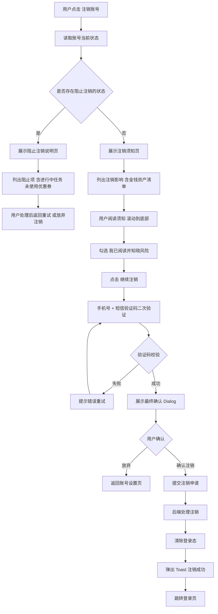

# 06-账号注销

| 字段 | 内容 |
|---|---|
| 模块名称 | 账号注销 |
| 业务归属 | 账号生命周期 |
| 入口路径 | 我的 Tab → 账号设置 → 注销账号 |
| 页面层级 | 三级 |
| 关联文档 | [03-登录页](./03-登录页.md)、我的 Tab → 账号设置 [待输出] |
| 版本 | v1.0 |
| 最后更新 | 2026-05-06 |

---

## 1. 模块定位

账号注销模块是用户主动解除与火象账号绑定关系的功能。属于应用市场审核合规要求的强制功能。

注销机制采用"立即注销 + 重新注册冷却期"模式：

- 用户提交注销申请后**立即生效**，账户立即失效
- 同手机号 **30 天内不可重新注册**
- 注销操作不可撤销

---

## 2. 入口与跳转

### 入口

- 我的 Tab → 账号设置 → 注销账号

### 出口

| 出口 | 触发条件 |
|---|---|
| 登录页 | 注销成功 |
| 上一页（账号设置）| 用户中途取消 |
| 注销阻止说明页 | 存在阻止注销的状态 |

---

## 3. 注销限制

### 3.1 阻止注销的状态

以下状态下**不允许**用户提交注销申请，必须先处理完毕：

| 阻止项 | 说明 | 用户处理方式 |
|---|---|---|
| 进行中任务 | 用户当前有进行中的日常任务 / 实训任务 / 现金挑战 | 用户先退出当前任务 |
| 有效优惠券未使用 | 账户内存在状态为"未使用且未过期"的优惠券 | 用户使用或主动放弃（如运营提供放弃功能） |

### 3.2 不阻止但需告知用户主动放弃的资产

以下属于"金钱性权益"，**不阻止**注销，但在注销弹窗中**明确告知用户主动放弃**：

| 项 | 说明 |
|---|---|
| 未提现的现金奖励 | 注销后将永久无法获得 |
| 未结算的补贴金 | 注销后将永久无法获得（包括本月未到结算日的部分） |
| 已获得未消耗的积分 | 注销后将永久失效 |
| 实训账户内余额 | 注销后将永久失效 |
| 模拟账户余额 | 注销后失效（无金钱属性，仅作告知） |

注销弹窗必须明确列出所有资产数额，由用户主动确认放弃后才能继续。

### 3.3 其他相关状态处理

| 状态 | 处理 |
|---|---|
| 实训账户处于锁定状态 | 不阻止注销，注销后账户永久失效 |
| 已建立的邀请下级关系 | 不影响下级用户。注销后用户的下级仍保留各自阶段进度，但不再算作本用户的邀请贡献 |
| 用户曾被他人邀请 | 注销后取消该绑定关系，但不影响邀请人的历史邀请记录 |

---

## 4. 注销流程

### 4.1 流程图



### 4.2 主要页面节点

#### 节点 1：注销须知页

| 区域 | 内容 |
|---|---|
| 顶部 | 返回按钮 + 标题"注销须知" |
| 警示卡片 | 醒目展示"注销账号是不可逆操作"等警示文案 |
| 注销影响清单 | 详见下方 4.3 节 |
| 资产清单 | 列出当前账户的金钱性资产数额 |
| 协议勾选 | "我已阅读并知晓注销风险，自愿放弃以上权益"复选框（必勾） |
| 主按钮 | "继续注销"（高度 48px，红色 `#F44336`，未勾选时置灰） |
| 次按钮 | "暂不注销"（文字按钮） |

#### 节点 2：手机号验证页

二次验证用户身份。

| 区域 | 内容 |
|---|---|
| 顶部 | 返回按钮 + 标题"身份验证" |
| 说明文字 | "为确保是您本人操作，请验证手机号" |
| 输入区 | 手机号（自动填入用户绑定手机号，不可编辑）+ 验证码输入框 |
| 主按钮 | "确认注销" |

#### 节点 3：最终确认 Dialog

| 区域 | 内容 |
|---|---|
| 标题 | "确认注销账号？" |
| 正文 | "注销后，您的账户将立即失效，所有数据（包括 X 元现金奖励、X 元补贴金、X 积分、X 张优惠券）将永久无法恢复。同手机号需在 30 天后才能重新注册。" |
| 主按钮 | "确认注销"（红色） |
| 次按钮 | "再考虑下"（灰色） |

### 4.3 注销影响清单（须知页展示）

```
账号注销将导致以下权益永久失效：

【账户数据】
- 所有学习记录、训练历史、任务进度
- 等级、经验值（XP）、邀请关系
- 实名认证信息（按合规要求匿名化处理）

【金钱性资产】
- 未提现的现金奖励：¥XXX
- 未结算的补贴金：¥XXX（包括本月尚未结算的部分）
- 已获得的积分：XXX
- 优惠券：X 张
- 实训账户余额：¥XXX
- 模拟账户余额：¥XXX

【其他】
- 已建立的邀请关系（下级用户不受影响，但您的邀请贡献清零）
- 已发布的火象专栏点赞、分享记录

【冷却期】
- 同手机号需在注销 30 天后才能重新注册
- 注销后无法找回任何账号数据
```

---

## 5. 关键交互

### 5.1 阻止注销的提示页

当存在阻止注销的状态时，进入"阻止注销说明页"：

| 区域 | 内容 |
|---|---|
| 顶部 | 返回按钮 + 标题"暂时无法注销" |
| 说明 | "您的账号存在以下情况，暂时无法注销：" |
| 阻止项列表 | 例如：<br/>• 您有 1 个进行中的任务[查看]<br/>• 您有 3 张未使用的优惠券[查看] |
| 提示 | "请处理以上事项后再申请注销。" |
| 按钮 | "我知道了"（返回上一页） |

每个阻止项可点击，跳转到对应处理页面（如任务详情 / 优惠券列表）。

### 5.2 须知页的滚动校验

为确保用户充分阅读注销影响清单：

- 须知页内容支持滚动
- 用户必须将内容**滚动到底部**才能勾选"我已阅读并知晓风险"
- 未滚动到底部时，勾选框置灰不可点击
- 提示文案"请阅读完整须知后勾选"

### 5.3 验证码规则

注销时的短信验证码与登录、找回密码共用规则：

- 6 位数字
- 有效期 5 分钟
- 60 秒冷却
- 单手机号发送上限累计 5 条（与登录页、找回密码场景共用配额）
- 达上限后锁定 1 小时，1 小时后计数重置

### 5.4 用户中途取消

- 任意阶段返回，已提交的注销申请未生效
- 已发送的验证码 5 分钟内有效
- 已勾选的须知确认状态不保留

### 5.5 注销成功后

- 后端清除用户 token，所有设备登录态失效
- App 跳转登录页
- 弹出 Toast "账号注销成功，您可在 30 天后重新注册"

---

## 6. 异常态

| 异常 | 表现 | 处理 |
|---|---|---|
| 网络不可用 | 接口请求失败 | 弹出 Toast "网络异常，请检查网络后重试" |
| 验证码错误 | 后端返回错误 | 输入框下方红色提示，允许重试 |
| 验证码过期 | 后端返回过期错误 | 提示"验证码已过期，请重新获取" |
| 提交注销时账户状态发生变化（如此时新接了任务） | 注销前再次校验阻止状态 | 提示"账户状态已变化，请刷新后重试"，重新进入流程 |
| 后端处理失败 | 提交后接口异常 | 提示"注销失败，请联系客服或稍后重试" |
| 重复提交注销 | 用户在 token 失效前再次提交 | 后端幂等处理，仅生效一次 |

---

## 7. 重新注册的冷却处理

### 7.1 冷却期判定

- 用户注销后，手机号进入 30 天冷却期
- 冷却期内尝试用相同手机号注册：
  - 在登录页输入该手机号 → 后端识别为冷却期内
  - 提示"该手机号在注销冷却期内，请 X 天后再试或更换手机号"
  - 显示剩余冷却天数（如"剩余 12 天"）

### 7.2 冷却期内的特殊场景

| 场景 | 处理 |
|---|---|
| 用户使用一键登录的手机号在冷却期内 | 一键登录失败，提示冷却期未结束 |
| 用户使用其他手机号注册 | 不受影响，正常注册新账户 |

### 7.3 数据匿名化处理

注销 30 天后，后端对用户敏感数据进行匿名化处理：

| 数据 | 处理方式 |
|---|---|
| 手机号 | 保留以维持冷却期校验，30 天后哈希化处理 |
| 实名信息 | 立即匿名化（按合规要求） |
| 用户行为日志 | 保留必要审计日志，敏感字段脱敏 |
| 用户上传内容 | 保留但归属脱敏 |

---

## 8. 接口约束

| 能力 | 说明 |
|---|---|
| 注销前置校验 | 检查账号是否处于阻止注销状态，返回阻止原因清单 |
| 注销前资产查询 | 返回当前所有金钱性资产数额，用于须知页展示 |
| 注销-发送验证码 | 下发短信验证码 |
| 注销-提交申请 | 接收验证码 + 注销确认，执行注销操作 |
| 冷却期校验 | 注册前校验手机号是否在 30 天冷却期内 |

接口的具体定义、字段、协议由后端开发设计，本文档仅描述业务诉求。

---

## 9. 合规要求

| 要求 | 说明 |
|---|---|
| 注销路径必须可达 | 应用市场强制要求，不可隐藏入口或设置过多障碍 |
| 用户主动确认 | 必须有"用户主动放弃权益"的明示确认环节 |
| 数据匿名化 | 按《个人信息保护法》要求处理用户数据 |
| 冷却期合理性 | 30 天冷却期需在用户协议中明示 |
| 注销后无法挽回 | 必须明确告知用户注销不可逆 |
| 审计日志 | 注销操作必须落库审计日志，至少保留 3 年 |
