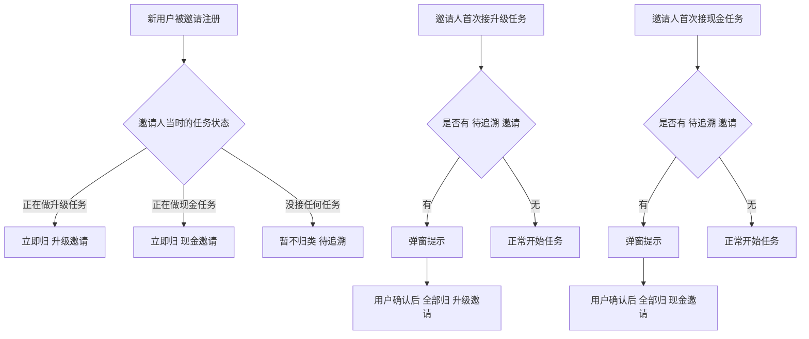

# 02-邀请中心

| 字段 | 内容 |
|---|---|
| 模块名称 | 邀请中心 |
| 业务归属 | 跨 Tab 通用 |
| 入口路径 | 我的 Tab → 邀请中心 / 训练页成长模块 / 现金挑战解锁位 |
| 页面层级 | 二级 |
| 关联文档 | [04-注册流程](../01-账号生命周期/04-注册流程.md)、训练页成长模块 [待输出]、现金奖励中心 [待输出] |
| 版本 | v1.0 |
| 最后更新 | 2026-05-06 |

---

## 1. 模块定位

邀请中心是火象 3.0 邀请系统的核心承载模块。3.0 的等级升级与现金挑战解锁高度依赖邀请机制，邀请中心是用户管理邀请关系的统一入口。

核心职责：

1. **数据展示**：展示用户邀请的总览数据、邀请记录列表
2. **邀请触发**：用户主动发起邀请，生成分享海报
3. **归属管理**：展示每个被邀请人的归属类别（升级邀请 / 现金邀请）

---

## 2. 入口与跳转

### 入口

| 入口 | 触发场景 |
|---|---|
| 我的 Tab → 邀请中心 | 用户主动进入 |
| 训练页成长模块 → 去邀请好友升级 | 升级邀请门槛未达成时 |
| 现金挑战解锁位 → 完成邀请解锁 | 现金挑战邀请门槛未达成时 |

### 出口

| 出口 | 触发条件 |
|---|---|
| 邀请详情页（被邀请人） | 用户点击邀请记录中的某一条 |
| 海报分享底部弹窗 | 用户点击"立即邀请"按钮 |
| 返回上一页 | 顶部返回按钮 |

---

## 3. 邀请关系机制（核心规则）

### 3.1 邀请关系的建立

邀请关系通过 **H5 注册路径**建立：

1. 用户通过 App 内"邀请"按钮分享 H5 链接
2. 被邀请人通过 H5 链接跳转到注册流程
3. 注册成功的瞬间，后端识别 H5 携带的邀请人 ID 参数
4. 在被邀请人账户中记录邀请关系
5. 邀请关系**永久不可修改**

详细见 [04-注册流程](../01-账号生命周期/04-注册流程.md)。

### 3.2 邀请的归属类别

每个被邀请人会被打上一个**归属类别标签**，归属永久不变：

| 归属 | 含义 |
|---|---|
| 升级邀请 | 该被邀请人计入"升级任务"的邀请进度 |
| 现金邀请 | 该被邀请人计入"现金挑战"的邀请进度 |

**归属确定的时机**：



### 3.3 归属规则的关键约束

| 规则 | 说明 |
|---|---|
| 大类内共享 | 被邀请人归到"升级邀请"后，**所有升级任务都能用这个邀请的进度**；归到"现金邀请"后所有现金挑战都能用 |
| 大类间互斥 | 升级邀请的进度不能用于现金挑战；现金邀请的进度不能用于升级任务 |
| 阶段进度永久累积 | 被邀请人完成的所有阶段（注册 / 领取实训 / 启动 / 付费）永久累积，不重置 |
| 追溯归类 | 用户首次接某类任务时，所有"待追溯"历史邀请一次性归此类 |
| 归属不可调整 | 一旦归到某类，永久不可改 |

### 3.4 追溯归类的提示

当用户接任务时存在"待追溯"邀请，弹出提示弹窗：

```
弹窗类型：中心 Dialog
标题：邀请归属说明
正文：你之前已邀请 X 位好友。
     开始本次任务后，这些好友将归于"升级邀请"类，
     并参与升级任务的邀请进度统计，归属一经确定不可更改。
按钮：取消 / 我知道了
```

用户点击"我知道了"后才正式开始任务并完成归类。点击"取消"则取消接任务。

提示**仅在用户首次接每个大类的任务时弹出**（即一个用户最多见到 2 次：首次接升级 + 首次接现金）。

### 3.5 邀请阶段判定

每个被邀请人有 4 个阶段判定，由后端识别行为自动推进：

| 阶段 | 判定条件 |
|---|---|
| 注册 | 被邀请人完成账号注册 |
| 领取实训账户 | 被邀请人成功领取实训账户 |
| 启动实训账户 | 被邀请人在实训账户上完成首次开仓下单 |
| 付费 | 被邀请人完成首次付费购买课程权益（在小鹅通付费后回调到火象后端） |

阶段进度**单向推进，不回退**（即使用户退订课程也不取消"已付费"标识）。

### 3.6 已注销用户的邀请关系处理

| 场景 | 处理 |
|---|---|
| 邀请人注销 | 不影响下级用户。下级被邀请人保留各自阶段进度，仅取消与邀请人的归属关系 |
| 被邀请人注销 | 不影响邀请人。邀请人邀请记录中保留该被邀请人，状态标记为"用户已注销" |

---

## 4. 邀请中心首页

### 4.1 页面结构

| 区域 | 内容 |
|---|---|
| 顶部导航 | 返回按钮 + 标题"邀请中心" |
| 总览数据卡 | 4 阶段统计 + 累计付费金额 |
| 主 CTA | "立即邀请"按钮 |
| 归属分类 Tab | 升级邀请 / 现金邀请 |
| 邀请记录列表 | 当前 Tab 下的邀请记录 |

### 4.2 总览数据卡

居中展示用户全部邀请的统计数据：

| 数据 | 说明 |
|---|---|
| 注册：X 人 | 已完成注册的被邀请人总数 |
| 领取：Y 人 | 已领取实训账户的被邀请人总数 |
| 启动：Z 人 | 已启动实训账户的被邀请人总数 |
| 付费：W 人 | 已付费的被邀请人总数 |
| 累计付费金额：¥XX | 所有被邀请人累计付费的总金额 |

显示规则：
- 4 阶段统计同行展示，使用大数字 + 阶段名称
- 累计付费金额单独一行突出展示

### 4.3 立即邀请主 CTA

| 项 | 说明 |
|---|---|
| 按钮位置 | 总览卡下方 |
| 按钮文案 | "立即邀请" |
| 高度 | 48px |
| 颜色 | 主色 `#E72737` |
| 点击行为 | 拉起分享海报底部弹窗（详见第 5 节）|

### 4.4 归属分类 Tab

仅 2 个 Tab：

| Tab | 展示内容 |
|---|---|
| 升级邀请 | 归属为"升级邀请"的所有被邀请人 |
| 现金邀请 | 归属为"现金邀请"的所有被邀请人 |

**待追溯（未归类）的邀请不展示在 Tab 列表中**。它们在用户首次接任务时通过弹窗一次性归类（详见 3.4 节）。

Tab 切换默认展示"升级邀请"。

### 4.5 邀请记录列表

每条记录展示：

| 字段 | 说明 |
|---|---|
| 脱敏昵称 | 按 [99-03 数据脱敏规则] 脱敏（如 "用**称"） |
| 邀请时间 | 被邀请人完成注册的时间 |
| 完整阶段链路 | 注册 ✓ → 领取 ✓ → 启动 ✓ → 付费 ✓（含每个阶段的达成时间戳） |
| 累计付费金额 | 仅在已完成"付费"阶段时展示 |
| 归属标签 | "升级邀请" / "现金邀请"（与 Tab 同义，作为冗余展示）|

**列表行为**：

| 项 | 规则 |
|---|---|
| 排序 | 仅按邀请时间倒序，不支持其他排序 |
| 默认加载 | 20 条 |
| 上拉加载 | 每次加载 20 条 |
| 下拉刷新 | 重新拉取最新数据 |
| 单条点击 | 展开 / 折叠"完整阶段链路"详情（无独立详情页）|

### 4.6 阶段链路展示

每条记录的完整阶段链路：

| 状态 | 展示 |
|---|---|
| 未达成 | 灰色圆点 + 阶段名称 + （未达成）|
| 已达成 | 主色圆点 + 阶段名称 + 达成时间戳 |

阶段链路始终展示全部 4 个阶段，已达成与未达成的视觉差异明显。

### 4.7 已注销用户的展示

被邀请人已注销时：

- 昵称展示为"用户已注销"
- 阶段链路保持注销前的状态
- 付费金额保持注销前的金额

### 4.8 空状态

| 场景 | 展示 |
|---|---|
| 当前 Tab 无邀请记录 | 居中插画 + 文案"还没有邀请记录，立即邀请好友赚奖励" + "立即邀请"按钮 |
| 首次进入邀请中心（无任何邀请） | 4 阶段统计全部为 0，列表显示空状态 |

---

## 5. 分享海报弹窗

### 5.1 弹窗规格

| 项 | 值 |
|---|---|
| 弹窗类型 | 底部弹窗（Bottom Sheet） |
| 高度 | 屏幕高度 80%（海报较高需要充分展示） |
| 圆角 | 顶部圆角 16px |
| 关闭方式 | 顶部 × 按钮 / 下拉手势 / 点击遮罩 |

### 5.2 弹窗结构

| 区域 | 内容 |
|---|---|
| 顶部 | × 关闭按钮 |
| 海报预览区 | 居中展示用户的专属海报（前端实时合成）|
| 分享渠道区 | 底部一行渠道按钮 |

### 5.3 海报内容

海报由前端实时合成，确保每个用户看到的是带有自己信息的专属海报。

**海报包含元素**：

| 元素 | 说明 |
|---|---|
| 火象品牌 Logo | 顶部展示 |
| 邀请人头像 | 用户头像，圆形展示 |
| 邀请人昵称 | 脱敏昵称 |
| 邀请人当前等级 | "Lv X · [称号]" |
| 邀请人当前实训账户规模 | "实训账户：$X,000" |
| 海报主题文案 | 按触发场景动态变化（详见 5.4） |
| 二维码 | 含邀请人 ID 参数，扫码进入 H5 注册页 |
| 底部宣传文案 | 火象品牌 Slogan |

### 5.4 海报场景文案

**按触发场景动态切换主题文案**：

| 触发场景 | 海报主题文案（示例，待运营提供 + 合规审核）|
|---|---|
| 邀请中心·主动邀请 | "加入火象，开启实训之旅" |
| 训练页成长模块·邀请升级 | "邀请你帮我成长 Lv [X+1]" |
| 现金挑战·解锁邀请 | "一起加入火象，挑战交易" |

**关键合规约束**：

| 要求 | 说明 |
|---|---|
| 文案弱化金钱表述 | 不直接出现"赚钱""现金""奖金"等高敏感词 |
| 弱化诱导性 | 不出现"扫码即赚""一定能赚"等引导话术 |
| 平台标识清晰 | 必须有"火象"品牌标识 |
| 资质合规 | 文案需通过合规审核后才能上线 |

详细文案 **[待运营提供 + 合规审核]**。

### 5.5 海报合成方式

**方式**：前端实时合成（Canvas / SVG）。

**合成流程**：

1. 用户点击"立即邀请"
2. App 拉取当前用户数据（昵称、头像、等级、实训账户规模）
3. App 根据触发场景选择对应的海报模板
4. 前端在 Canvas / SVG 中绘制：
   - 加载海报背景图
   - 绘制用户信息文字
   - 加载用户头像
   - 生成二维码（含邀请人 ID 参数）
   - 合成最终图片
5. 展示在弹窗中

**性能要求**：合成时间 < 500ms（用户感知不到延迟）。

### 5.6 二维码生成

| 项 | 规则 |
|---|---|
| 生成方式 | 前端实时生成（使用 qrcode.js 等库）|
| 内容 | H5 注册页 URL + 邀请人 ID 参数（如 `https://invite.huoxiang.com/?inviter=USER_ID`）|
| 容错率 | 中等（M 级别）|
| 颜色 | 黑色二维码 + 白色背景（或主题适配色）|

### 5.7 分享渠道

V1 支持的分享渠道：

| 渠道 | 行为 |
|---|---|
| 保存图片 | 将海报保存到设备相册 |
| 微信好友 | 调起微信分享好友面板 |
| 朋友圈 | 调起微信分享朋友圈面板 |
| 系统分享面板 | 调起 iOS / Android 系统分享面板（用户可选其他 App）|

**分享渠道展示**：底部一行图标按钮 + 文字标签，至少 4 个图标可见，超出可左右滑动。

### 5.8 海报模板的运营配置

海报模板（背景图、文案、布局）由运营在后台配置：

- 不同触发场景对应不同模板
- 详见 [98-16-邀请海报模板（待输出）]

---

## 6. 触发场景的 CTA 设计

不同入口的"邀请触发"按钮文案与跳转：

### 6.1 邀请中心·主动邀请

| 项 | 内容 |
|---|---|
| 按钮位置 | 邀请中心首页总览卡下方 |
| 按钮文案 | "立即邀请" |
| 触发行为 | 拉起海报弹窗（通用模板）|

### 6.2 训练页成长模块·邀请升级

| 项 | 内容 |
|---|---|
| 按钮位置 | 成长模块的 CTA 按钮 |
| 按钮文案 | "去邀请好友升级"（仅在 XP 达标但邀请未达标时展示）|
| 触发行为 | 拉起海报弹窗（升级模板）|

### 6.3 现金挑战·解锁邀请

| 项 | 内容 |
|---|---|
| 按钮位置 | 现金挑战详情页 / 列表卡片 |
| 按钮文案 | "完成邀请解锁挑战" |
| 触发行为 | 拉起海报弹窗（现金挑战模板）|

---

## 7. 异常态

| 异常 | 表现 | 处理 |
|---|---|---|
| 邀请记录加载失败 | 列表为空 | 显示"加载失败，点击重试" |
| 海报合成失败 | 海报区域加载失败 | 显示占位图 + "海报加载失败，点击重试" |
| 头像加载失败 | 海报中头像位置 | 使用默认头像兜底 |
| 二维码生成失败 | 海报二维码位置 | 显示"二维码生成失败"占位，海报仍可展示其他内容 |
| 分享 SDK 不可用 | 微信 / 朋友圈分享按钮置灰 | Toast 提示"分享功能暂不可用，请稍后重试" |
| 保存图片权限被拒 | 用户未授权相册权限 | 引导用户去设置开启权限 |
| 网络不可用 | 拉取数据失败 | 显示重试入口 |

---

## 8. 接口约束

| 能力 | 说明 |
|---|---|
| 拉取邀请总览 | 返回 4 阶段统计、累计付费金额 |
| 拉取邀请记录列表 | 分页拉取，按归属类别筛选 |
| 拉取海报模板配置 | 根据触发场景返回对应模板配置 |
| 拉取用户海报数据 | 拉取用户的昵称、头像、等级、实训账户规模 |
| 邀请关系绑定（注册时调用）| 详见 [04-注册流程](../01-账号生命周期/04-注册流程.md) |
| 阶段进度更新 | 后端在被邀请人完成各阶段时自动推进 |

接口的具体定义、字段、协议由后端开发设计，本文档仅描述业务诉求。

---

## 9. 合规要求

| 要求 | 说明 |
|---|---|
| 海报文案合规 | 弱化金钱表述，避免"赚钱""现金"等高敏感词 |
| 邀请关系透明 | 邀请规则在用户协议或帮助页中明确说明 |
| 被邀请人信息保护 | 列表中的昵称必须脱敏，头像不展示 |
| 推广合规 | 海报需在合规审核后上线，应用市场审核要求避免诱导分享 |
| 拒绝过度激励 | 邀请奖励不直接以"金钱激励"形式呈现给被邀请人 |

---

## 10. 与其他模块的关联

| 模块 | 关联点 |
|---|---|
| [04-注册流程](../01-账号生命周期/04-注册流程.md) | 邀请关系建立时机 |
| [01-启动页](../01-账号生命周期/01-启动页.md) | H5 跳转 App 时的邀请参数传递 |
| 训练页成长模块 [待输出] | 升级邀请进度展示 + "去邀请"按钮 |
| 等级详情页 [待输出] | 升级邀请进度展示 |
| 现金奖励中心 [待输出] | 现金挑战邀请门槛 + 解锁逻辑 |
| 我的页 [待输出] | 邀请中心入口 |

---

## 11. V1 范围限制

明确**不在 V1 范围**的功能：

| 功能 | 说明 |
|---|---|
| 邀请奖励独立发放 | 邀请的价值仅体现在升级 / 现金挑战上，不额外发放邀请奖励 |
| 邀请排行榜 | 不展示用户间的邀请排名 |
| 邀请人手动调整归属 | 归属永久不可调整 |
| 邀请关系树（多级邀请）| 仅记录一级邀请关系，不做多级分销 |
