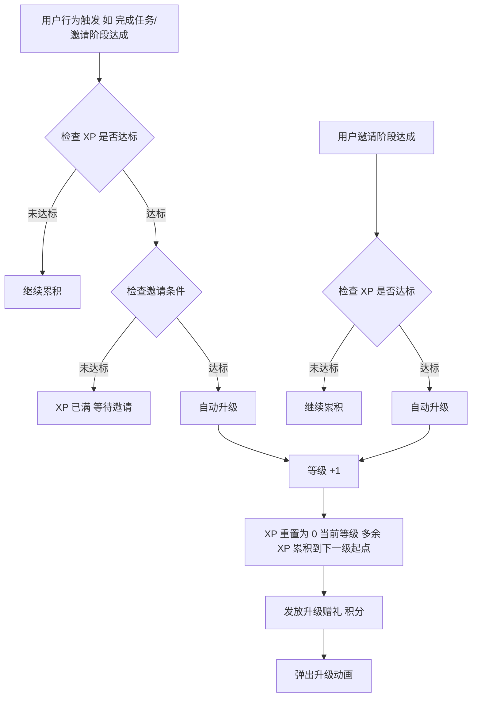

# 02-成长模块

| 字段 | 内容 |
|---|---|
| 模块名称 | 成长模块（训练页顶部）|
| 业务归属 | 训练 Tab |
| 入口路径 | 训练 Tab → 顶部成长模块 |
| 页面层级 | 一级嵌入（训练页内）|
| 关联文档 | [01-训练主页面](./01-训练主页面.md)、[03-等级详情页](./03-等级详情页.md)、[02-邀请中心](../02-跨Tab通用/02-邀请中心.md) |
| 版本 | v1.0 |
| 最后更新 | 2026-05-06 |

---

## 1. 模块定位

成长模块是训练页顶部的卡片，承载用户的成长状态全景：

- 当前等级与称号
- XP 进度（距离下一级阈值）
- 邀请条件进度（升级双判定的另一半）
- 升下一级的赠礼预告
- 引导用户去做任务 / 去邀请的 CTA

模块定位是"用户成长的状态卡 + 行动引导"，非完整成长详情（详情见 [03-等级详情页](./03-等级详情页.md)）。

视觉为**普通进度条卡片**（不做 3D 效果），3D 椭圆轨道效果仅在等级详情页使用。

---

## 2. 入口与跳转

### 入口

- 训练页顶部第一个区域

### 出口

| 出口 | 触发条件 |
|---|---|
| [03-等级详情页](./03-等级详情页.md) | 用户点击卡片右上角"等级详情"入口 |
| [02-邀请中心](../02-跨Tab通用/02-邀请中心.md) | 用户点击"去邀请好友升级"CTA（XP 满但邀请未达标时）|
| 滚动到下方任务区 | 用户点击"去做任务"CTA（XP 未满时）|

---

## 3. 模块结构

### 3.1 整体布局

| 区域 | 内容 |
|---|---|
| 卡片头部 | 等级标签 + 称号 + 右上角"等级详情"入口 |
| XP 进度区 | XP 进度条 + 当前 XP / 下一级阈值 |
| 邀请进度区 | 邀请条件进度（仅在 XP 已满或接近满时高亮显示）|
| 升级赠礼提示 | "升至下一级解锁 X 积分" |
| CTA 按钮 | 根据状态机动态变化 |

### 3.2 高度规格

| 项 | 值 |
|---|---|
| 卡片高度 | 屏幕高度的 1/5（约 160px）|
| 内部边距 | 16px |
| 圆角 | 12px |
| 背景 | 渐变或主色浅化背景 [待 UI 提供] |

### 3.3 卡片头部

| 元素 | 内容 |
|---|---|
| 等级标签 | "Lv X · [称号]"（如 "Lv 3 · 中级交易员"）|
| 等级详情入口 | 右上角小箭头 + "等级详情"文字（点击跳转 [03-等级详情页](./03-等级详情页.md)）|

### 3.4 XP 进度区

| 元素 | 内容 |
|---|---|
| 进度条 | 主色 `#E72737` 填充，背景灰 `#E9EDF4` |
| 数字 | 当前 XP / 下一级阈值（如 "230 / 630"）|
| 状态文字 | "距离下一级还需 X XP" |

**已达最高级 Lv7 特殊处理**：

- 进度条满显示
- 文字变为"已达最高等级"
- 不显示邀请进度区、不显示升级赠礼

### 3.5 邀请进度区

仅当 **XP 已满** 时高亮展示邀请进度（XP 未满时此区域可隐藏或弱化展示）。

| 元素 | 内容 |
|---|---|
| 邀请条件描述 | 该等级升级所需的邀请条件文字描述（如 "邀请 3 人启动实训账户"）|
| 当前邀请进度 | "已达成 2/3 人" |
| 进度条（可选）| 邀请进度条（数字小时可用）|

详细邀请条件由任务体系配置决定（详见任务体系文档）。

### 3.6 升级赠礼提示

| 元素 | 内容 |
|---|---|
| 提示文字 | "升至下一级解锁 X 积分"（X 由任务体系配置决定，如 99 积分）|
| 视觉 | 小字号 12px，主色或次色 |

V1 不支持点击赠礼跳转积分商城（之前确认过）。

### 3.7 CTA 按钮（状态机）

CTA 文案与跳转根据用户当前状态动态变化：

| 用户状态 | CTA 文案 | 点击行为 |
|---|---|---|
| XP 未满 + 邀请未达标 | 去做任务 | 滚动到下方任务区（账户卡片）|
| XP 已满 + 邀请未达标 | 去邀请好友升级 | 跳转邀请中心 / 拉起分享海报 |
| XP 未满 + 邀请已达标 | 去做任务 | 滚动到下方任务区 |
| XP 已满 + 邀请已达标 | （应自动升级，不应停留此态）| - |
| 已达 Lv7 | （隐藏 CTA）| - |

**按钮规则**：

- 高度 40px
- 主色背景
- 文字 14px Medium
- 全宽或居中

---

## 4. 等级升级逻辑（关键规则）

### 4.1 升级判定

等级升级 = **XP 阈值达成 + 邀请条件达成**（双重判定）。

### 4.2 升级时机

### 4.3 XP 累积规则（关键）

- 用户在某等级做任务获得 XP
- XP 满后**继续累积**（不丢失），但等级不会升级（因为可能邀请未达标）
- 升级时多余的 XP 自动累积到**下一级的起点**
- 用户在未升级到下一级前**不能做下一级的任务**（仅当前等级任务可做）

### 4.4 升级动画与赠礼

升级时机触发后：

| 步骤 | 行为 |
|---|---|
| 1 | 用户当前页面弹出"升级"全屏动画或大弹窗 [视觉 待 UI 提供] |
| 2 | 动画展示升级赠礼（积分数额）|
| 3 | 用户点击"领取赠礼"或"知道了" |
| 4 | 关闭动画，更新 XP 进度、等级标签、邀请进度等 UI |

升级动画**优先级最高**，可在用户当前在任意页面操作时弹出（除外部 WebTrader）。

---

## 5. 关键交互

### 5.1 等级详情入口

卡片右上角 "等级详情 →" 文字按钮：

- 点击跳转 [03-等级详情页](./03-等级详情页.md)
- 等级详情页展示完整 7 级路径、当前等级权益、下一级权益、各等级任务清单

### 5.2 状态切换

CTA 按钮的状态根据 XP / 邀请进度实时切换：

- 用户做任务获得 XP，XP 满时 CTA 自动变为"去邀请好友升级"
- 用户邀请进度达成，CTA 自动变为"去做任务"
- 切换实时，无需用户主动刷新

### 5.3 邀请进度的更新

被邀请人完成各阶段（注册 / 领取 / 启动 / 付费）后，邀请进度实时更新到成长模块。

### 5.4 用户首次接任务时的归属告知

当用户首次接升级任务时（点击任务区"开始"），如有"待追溯"邀请，弹出归属告知弹窗（详见 [02-邀请中心](../02-跨Tab通用/02-邀请中心.md) 第 3.4 节）。

---

## 6. 异常态

| 异常 | 表现 | 处理 |
|---|---|---|
| 等级数据接口失败 | 模块整体加载失败 | 显示骨架屏 / "加载失败"占位 |
| 邀请进度接口失败 | 邀请进度区数据为空 | 显示 "0/X" 兜底 |
| 升级赠礼配置缺失 | 提示文字位置 | 隐藏赠礼提示 |
| 网络断开 | 模块数据无法刷新 | 显示上次缓存数据 + 顶部网络异常提示 |

---

## 7. 接口约束

| 能力 | 说明 |
|---|---|
| 用户成长状态接口 | 返回：当前等级、称号、当前 XP、下一级阈值、邀请条件描述、当前邀请进度、升级赠礼配置 |
| 升级触发接口 | 后端在用户行为后判定是否触发升级，返回升级结果 |

接口的具体定义、字段、协议由后端开发设计，本文档仅描述业务诉求。
