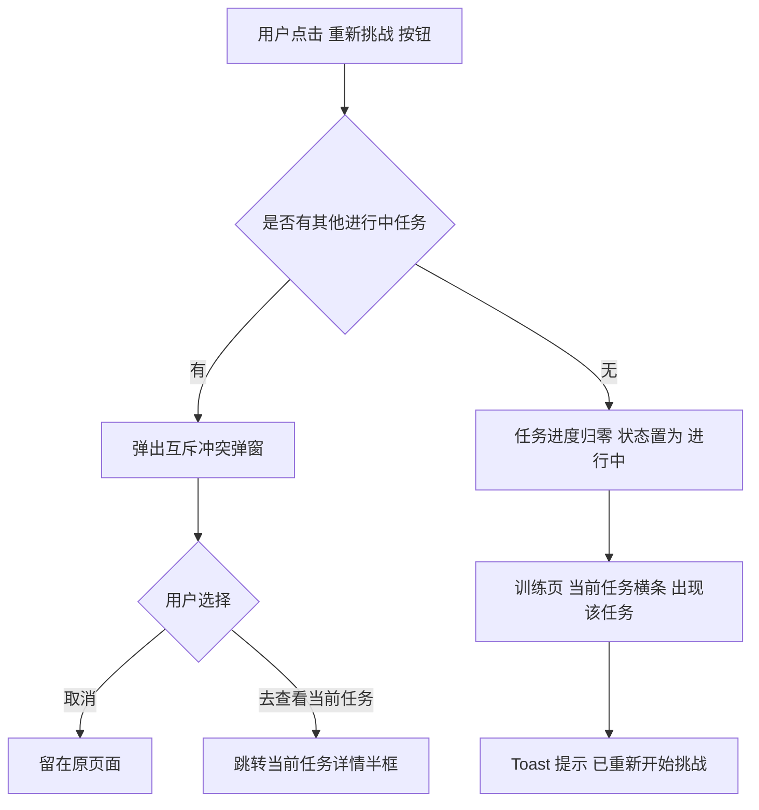

# 05-训练历史

| 字段 | 内容 |
|---|---|
| 模块名称 | 训练历史 |
| 业务归属 | 训练 Tab |
| 入口路径 | 训练页 → 训练历史区域 → 查看全部 |
| 页面层级 | 二级 |
| 关联文档 | [01-训练主页面](./01-训练主页面.md)、[04-任务详情半框](./04-任务详情半框.md) |
| 版本 | v1.0 |
| 最后更新 | 2026-05-06 |

---

## 1. 模块定位

训练历史模块用于用户查看自己**已完成 / 已失败 / 已失效**的所有任务记录。

包含两个层面：
- **训练页内嵌区域**：默认展示最近 3 条历史记录
- **完整列表页**：用户点击"查看全部"进入

进行中任务**不在训练历史展示**（在"当前任务横条"展示）。

---

## 2. 入口与跳转

### 入口

- 训练页 → 训练历史区域 → "查看全部"链接

### 出口

| 出口 | 触发条件 |
|---|---|
| [04-任务详情半框](./04-任务详情半框.md) | 点击任意历史卡片 |
| 返回训练页 | 顶部返回按钮 |

---

## 3. 训练页内嵌训练历史区域

### 3.1 区域结构

| 元素 | 说明 |
|---|---|
| 标题 | "训练历史"（左对齐 + 标题装饰）|
| 查看全部 | 右侧"查看全部 →"链接 |
| 列表 | 默认 3 条最近记录 |
| 空状态 | 一行轻提示文字（详见 3.3）|

### 3.2 历史卡片字段

每张卡片展示：

| 字段 | 说明 |
|---|---|
| 任务编号 | "Lv X-模 0Y" / "Lv X-实 0Y" / "现金挑战 0Z" |
| 任务名 | 任务名称 |
| 等级标签 | "Lv2-模拟" / "Lv2-实训" / "现金挑战"|
| 状态标签 | 详见 3.4 |
| 完成 / 失败 / 失效时间 | 时间戳，按时间显示规则 |
| 获得奖励（仅成功）| "+10 XP" / "+99 积分" / "+$50" |
| 重新挑战按钮（仅失败）| "重新挑战"（小按钮）|

### 3.3 空状态

无任何历史记录时（新用户）：

| 元素 | 内容 |
|---|---|
| 文字 | "还没有训练记录，完成第一个任务后会展示在这里" |
| 视觉 | 一行轻提示，无插画、无 CTA 按钮 |

### 3.4 状态标签

| 状态 | 标签文字 | 颜色 |
|---|---|---|
| 已完成 | 挑战成功 | 绿色 `#2DC771` |
| 已失败 | 挑战失败 | 红色 `#F44336` |
| 已失效 | 已失效 | 灰色 `#999999` |

### 3.5 时间显示规则

| 时间区间 | 展示方式 |
|---|---|
| 1 小时内 | X 分钟前 |
| 24 小时内 | X 小时前 |
| 昨天 | 昨天 HH:MM |
| 7 天内 | X 天前 |
| 当年 | MM-DD HH:MM |
| 跨年 | YYYY-MM-DD |

### 3.6 卡片操作

| 操作 | 行为 |
|---|---|
| 点击卡片主体 | 跳转 [04-任务详情半框](./04-任务详情半框.md)（含状态信息） |
| 点击"重新挑战"按钮（仅失败任务）| 直接重新挑战，不进半框（半框跳转方式作为备选）|

> 注意：如果用户当前已有其他进行中任务，点击"重新挑战"会触发互斥冲突弹窗，详见 [04-任务详情半框](./04-任务详情半框.md)。

---

## 4. 完整训练历史列表页

### 4.1 页面结构

| 区域 | 说明 |
|---|---|
| 顶部导航栏 | 返回按钮 + 标题"训练历史"|
| 筛选 Tab | 全部 / 成功 / 失败 / 已失效 |
| 列表区 | 训练历史卡片列表 |
| 空状态 | 当前筛选下无记录时显示 |

### 4.2 筛选 Tab

| Tab | 筛选条件 |
|---|---|
| 全部（默认）| 显示所有状态 |
| 成功 | 仅已完成 |
| 失败 | 仅已失败 |
| 已失效 | 仅已失效 |

V1 不提供按任务类型（日常 / 实训 / 现金）筛选。

### 4.3 列表卡片

字段与训练页内嵌区域一致（详见 3.2 节）。

### 4.4 列表加载规则

| 项 | 规则 |
|---|---|
| 默认加载 | 首屏 20 条 |
| 上拉加载 | 每次加载 20 条 |
| 下拉刷新 | 重新拉取最新数据 |
| 加载完毕 | 列表底部显示"已经到底啦"|

### 4.5 排序规则

- 按**完成 / 失败 / 失效时间倒序**
- 同一时间点的多条记录按 ID 倒序

### 4.6 空状态

| 场景 | 显示 |
|---|---|
| "全部" Tab 下无记录（新用户）| 居中插画 + 文字"还没有训练记录" |
| 切换到具体筛选下无记录 | 文字"暂无 [筛选名] 的记录"|

### 4.7 切换筛选 Tab 后的行为

- 切换 Tab 时列表清空，按新筛选重新加载
- 不保留滚动位置（每次切换都从顶部开始）

---

## 5. 失败任务的"重新挑战"流程

---

## 6. 关键交互

### 6.1 滚动行为

- 顶部导航栏始终固定
- 筛选 Tab 区域**吸顶**（用户向下滚动时筛选 Tab 保留在顶部，便于切换）
- 中间列表区随滚动

### 6.2 重新挑战的实时反馈

用户点击"重新挑战"成功后：

- Toast"已重新开始挑战"
- 列表中该卡片状态从"挑战失败"变为"进行中"，并自动**移出训练历史**（进行中任务不在训练历史展示）

### 6.3 已失效任务的特殊提示

用户点击"已失效"任务的卡片，半框内显示：

> "此任务已因等级升级而失效，不可再做。"

无任何操作按钮，仅可关闭半框。

---

## 7. 异常态

| 异常 | 表现 | 处理 |
|---|---|---|
| 列表接口失败 | 列表为空 | 显示"加载失败，点击重试" |
| 上拉加载失败 | 列表底部 | 显示"加载失败，点击重试" |
| 重新挑战接口失败 | 操作无响应 | Toast"操作失败，请重试" |
| 网络不可用 | 整体加载失败 | 显示网络异常提示 |

---

## 8. 接口约束

| 能力 | 说明 |
|---|---|
| 训练历史列表 | 分页拉取，支持按状态筛选 |
| 训练历史最近 N 条 | 训练页内嵌区域调用，返回最近 3 条 |
| 重新挑战 | 接收用户对失败任务的重新挑战请求，重置进度并恢复进行中状态 |

接口的具体定义、字段、协议由后端开发设计，本文档仅描述业务诉求。
