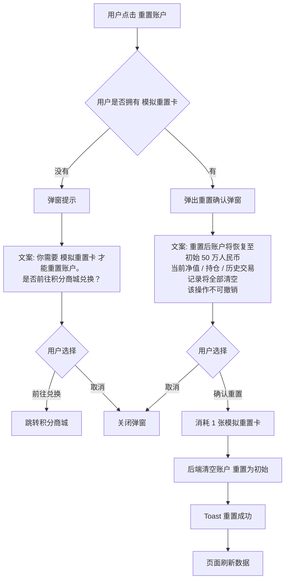

# 09-账户详情页

| 字段 | 内容 |
|---|---|
| 模块名称 | 账户详情页（模拟账户 / 实训账户）|
| 业务归属 | 训练 Tab |
| 入口路径 | 训练主页 → 实训账户卡片标题区 / 模拟账户卡片标题区 |
| 页面层级 | 二级 |
| 关联文档 | [01-训练主页面](./01-训练主页面.md)、[10-WebTrader中转](./10-WebTrader中转.md) |
| 版本 | v1.0 |
| 最后更新 | 2026-05-06 |

---

## 1. 模块定位

账户详情页是用户深入查看自己**单个账户**详细数据的页面。模拟账户和实训账户**各自一个独立详情页**（V1 不做合并 Tab 切换）。

两个详情页结构相似但内容差异：

| 维度 | 模拟账户详情 | 实训账户详情 |
|---|---|---|
| 初始资金 | ¥500,000 人民币 | $1,000-$100,000 美元（按等级）|
| 重置功能 | 支持（用积分商城的"模拟重置卡"）| 不支持 |
| 锁定状态 | 不存在 | 存在（基于平台风控规则）|
| 关联补贴金 | 无 | 有 |
| 关联现金奖励 | 无 | 有 |

---

## 2. 入口与跳转

### 入口

| 入口 | 进入哪个详情页 |
|---|---|
| 训练主页 → 模拟账户卡片标题区 | 模拟账户详情页 |
| 训练主页 → 实训账户卡片标题区 | 实训账户详情页 |
| 首页 → 实训账户简卡 | 实训账户详情页 |

### 出口

| 出口 | 触发条件 |
|---|---|
| WebTrader 中转 | 点击"去交易"按钮 |
| 持仓详情 | 点击持仓列表中的某条 |
| 平仓记录详情 | 点击平仓记录中的某条 |
| 模拟重置卡兑换 | 仅模拟账户：点击"重置账户"（积分商城）|
| 返回训练主页 | 顶部返回按钮 |

---

## 3. 通用页面结构

模拟账户和实训账户共享一套基础结构：

| 顺序 | 区域 | 说明 |
|---|---|---|
| 1 | 顶部导航栏 | 返回 + 标题"模拟账户" / "实训账户" |
| 2 | 账户数据概览 | 净值、盈亏、持仓等核心数据 |
| 3 | 操作按钮区 | 去交易 / 重置账户（仅模拟）|
| 4 | 持仓列表 | 当前未平仓持仓 |
| 5 | 平仓记录 | 已平仓的交易历史 |

---

## 4. 模拟账户详情页

### 4.1 顶部导航

| 元素 | 内容 |
|---|---|
| 左侧 | 返回按钮 |
| 标题 | "模拟账户" |
| 右侧 | "重置账户"文字按钮 |

### 4.2 账户数据概览

| 数据 | 说明 |
|---|---|
| 账户规模（初始资金）| ¥500,000 人民币（固定）|
| 当前净值 | 当前账户总价值（含持仓浮动盈亏）|
| 累计盈亏 | 净值 - 初始资金（含盈亏率，如 "+1.2%" / "-3.5%"）|
| 今日盈亏 | 今天净值变化 |
| 持仓数 | 当前未平仓持仓数量 |
| 持仓盈亏 | 当前持仓的浮动盈亏 |
| 已平仓盈亏 | 累计已实现盈亏 |

视觉规则：盈利红色 `#F44336`，亏损绿色 `#2DC771`（金融行业涨红跌绿惯例）。

### 4.3 操作按钮

| 按钮 | 行为 |
|---|---|
| 去交易（主按钮）| 跳转 [10-WebTrader 中转](./10-WebTrader中转.md)，使用模拟账户登录 |
| 重置账户（次按钮）| 弹出重置确认弹窗 |

### 4.4 重置账户流程

**重置规则**：

| 项 | 规则 |
|---|---|
| 何时可用 | 任意时刻（无限制）|
| 次数限制 | 无限次（取决于用户拥有多少张重置卡）|
| 重置范围 | 整个模拟账户（净值、持仓、平仓记录全部清空）|
| 历史训练任务 | 不影响。已完成的任务、获得的 XP / 积分不变 |
| 进行中任务 | 影响：重置后清空持仓 → 进行中的任务可能立即变为"挑战失败" |

> 重置时如有进行中任务（且任务依赖账户数据），需要二次确认提示用户。

### 4.5 持仓列表

仅展示当前账户的**未平仓**持仓。每条展示：

| 字段 | 说明 |
|---|---|
| 标的代码 + 名称 | 如 "EURUSD 欧元/美元" |
| 持仓方向 | 买入 / 卖出 |
| 持仓量 | 手数 |
| 开仓价 | 开仓时的价格 |
| 当前价 | 实时价格（V1 由 WebTrader 同步，如不可同步则按用户上次平仓时的快照展示）|
| 浮动盈亏 | 当前价相对开仓价的盈亏 |
| 操作 | "查看详情"链接 |

V1 持仓数据**不在 App 内实时更新**（不显示行情），仅展示用户最近一次操作后的快照。实时操作引导用户去 WebTrader。

### 4.6 平仓记录

按平仓时间倒序展示：

| 字段 | 说明 |
|---|---|
| 标的代码 + 名称 | 同上 |
| 持仓方向 | 同上 |
| 平仓价 | 平仓时的价格 |
| 持仓时间 | 从开仓到平仓的时长 |
| 已实现盈亏 | 平仓后的实际盈亏 |
| 平仓时间 | 时间戳 |

**加载策略**：默认加载 20 条，上拉加载更多。

---

## 5. 实训账户详情页

### 5.1 顶部导航

| 元素 | 内容 |
|---|---|
| 左侧 | 返回按钮 |
| 标题 | "实训账户" |
| 右侧 | 无 |

### 5.2 账户数据概览

| 数据 | 说明 |
|---|---|
| 账户规模 | 当前等级对应的实训账户规模（如 $5,000）|
| 账户状态 | 运行中 / 已锁定 / 未启动 |
| 当前净值 | 当前账户总价值 |
| 累计盈亏 + 盈亏率 | 同模拟账户 |
| 今日盈亏 | 同模拟账户 |
| 持仓数 + 持仓盈亏 | 同模拟账户 |
| 已平仓盈亏 | 同模拟账户 |
| 累计获得补贴金 | 仅实训账户：从该账户产生的补贴金累计金额 |
| 累计获得现金奖励 | 仅实训账户：从该账户完成现金挑战累计获得的奖金 |

**账户状态详解**：

| 状态 | 含义 | 视觉色 |
|---|---|---|
| 运行中 | 账户正常使用中，可交易 | `#2DC771` 绿 |
| 已锁定 | 账户被平台风控锁定，不可交易 | `#FF9F1C` 橙 |
| 未启动 | 账户已领取但用户尚未首次开仓 | `#999999` 灰 |

> 锁定的具体触发条件、解锁机制由平台风控规则决定，**不在本 PRD 范围**。详见风控规则 [待平台提供]。

### 5.3 操作按钮

| 按钮 | 状态影响 |
|---|---|
| 去交易（主按钮）| 仅"运行中"和"未启动"状态可点击；"已锁定"状态置灰 |

实训账户**没有**"重置"功能。

### 5.4 锁定状态的页面表现

账户被锁定时：

| 元素 | 处理 |
|---|---|
| 顶部 | 显示锁定提示横条："您的账户已被锁定，请联系客服" |
| 操作按钮 | "去交易"置灰 |
| 持仓 / 平仓数据 | 仍可查看（只读）|
| 联系客服入口 | 提供客服入口（详见全局规范）|

### 5.5 持仓列表 / 平仓记录

与模拟账户一致，详见 4.5、4.6 节。

### 5.6 用户没有实训账户时

如用户尚未领取实训账户：

- 页面不展示数据
- 中央展示"领取实训账户"引导卡片：
  - 标题"领取你的实训账户"
  - 描述"开启实训之旅，完成挑战获取奖励"
  - CTA "立即领取"
- 点击"立即领取"跳转**外部 H5 领取页面**（不在本 PRD 范围）

---

## 6. 关键交互

### 6.1 持仓 / 平仓记录刷新

| 触发场景 | 行为 |
|---|---|
| 用户进入页面 | 自动拉取最新数据 |
| 用户下拉刷新 | 重新拉取 |
| 用户从 WebTrader 返回 | 自动刷新（用户可能在 WebTrader 中开仓 / 平仓）|

### 6.2 数据为空时的展示

| 场景 | 表现 |
|---|---|
| 无持仓 | 持仓列表显示"暂无持仓" |
| 无平仓记录 | 平仓记录显示"暂无交易记录" |

---

## 7. 异常态

| 异常 | 表现 | 处理 |
|---|---|---|
| 数据加载失败 | 概览数据为空 | 显示骨架屏 + "加载失败，点击重试" |
| 持仓 / 平仓加载失败 | 列表为空 | 局部错误提示 + 重试 |
| 重置后端失败（模拟）| 用户卡片仍显示原数据 | Toast"重置失败，请重试" |
| WebTrader 跳转失败 | "去交易"无响应 | 详见 [10-WebTrader 中转](./10-WebTrader中转.md) |

---

## 8. 接口约束

| 能力 | 说明 |
|---|---|
| 拉取账户概览 | 返回账户规模、净值、盈亏等核心数据 |
| 拉取持仓列表 | 返回当前未平仓持仓 |
| 拉取平仓记录 | 分页返回平仓历史 |
| 重置模拟账户 | 校验模拟重置卡，扣减并重置账户 |
| 检查账户状态 | 返回账户当前状态（运行中 / 已锁定 / 未启动）|

接口的具体定义、字段、协议由后端开发设计，本文档仅描述业务诉求。

---

## 9. V1 范围限制

明确**不在 V1 范围**的功能：

| 功能 | 说明 |
|---|---|
| App 内实时行情 | 不展示行情，仅快照数据 |
| App 内开仓 / 平仓操作 | 不在 App 内承载，全部走 WebTrader |
| 多个实训账户 | V1 假设用户最多一个实训账户 |
| 账户切换 | 不需要（每个账户独立详情页）|
| 账户数据导出 | 不支持 |
