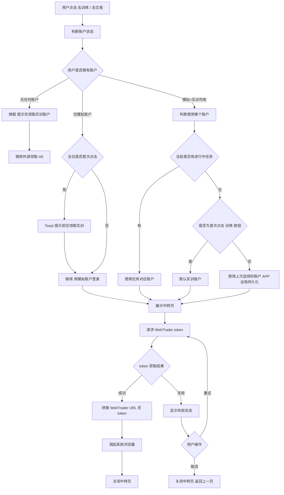

# 10-WebTrader 中转

| 字段 | 内容 |
|---|---|
| 模块名称 | WebTrader 中转 |
| 业务归属 | 训练 Tab |
| 入口路径 | 训练页底部"去训练"按钮 / 账户详情页"去交易"按钮 |
| 页面层级 | 二级（中转） |
| 关联文档 | [01-训练主页面](./01-训练主页面.md)、[09-账户详情页](./09-账户详情页.md) |
| 版本 | v1.0 |
| 最后更新 | 2026-05-06 |

---

## 1. 模块定位

WebTrader 中转页是用户从 App 跳转到外部 WebTrader（浏览器端交易系统）的过渡页面。

火象 3.0 核心架构决策：**App 内不承载交易界面**，所有实际交易行为通过外部 WebTrader 完成。WebTrader 中转页解决以下问题：

1. **状态反馈**：跳转 WebTrader 需要先获取登录 token，过程是异步的，给用户清晰的状态展示
2. **错误处理**：token 获取失败、网络异常等场景有明确的提示和处理
3. **账户判定**：根据用户操作上下文确定使用哪个账户登录（模拟 / 实训）

> 注：WebTrader 自动登录的 token 协议、URL 参数格式等技术细节 **[待技术对齐]**，本文档仅描述产品逻辑。

---

## 2. 入口与跳转

### 入口

| 入口 | 触发场景 |
|---|---|
| 训练主页底部"去训练"按钮 | 用户主动发起训练 |
| 模拟账户详情页"去交易"按钮 | 模拟账户登录 |
| 实训账户详情页"去交易"按钮 | 实训账户登录 |

### 出口

| 出口 | 触发条件 |
|---|---|
| 系统浏览器（带 token URL）| token 获取成功，跳转 WebTrader |
| 返回上一页 | token 获取失败，用户主动取消 |
| 账户领取 H5 | 用户无任何账户时引导领取 |

---

## 3. 中转页结构

### 3.1 页面布局

中转页为**全屏覆盖层**（非独立 Tab 页面，类似加载页）：

| 元素 | 内容 |
|---|---|
| 顶部 | 关闭按钮（× 图标，左上角） |
| 中央区域 | Loading 动画 + 状态文字 |
| 底部 | 帮助提示（如适用）|

### 3.2 视觉规则

| 状态 | 视觉 |
|---|---|
| 加载中 | 中央 Loading 动画 + "正在为你打开训练系统..." |
| 成功（即将跳转）| "跳转中..." + 短暂 Toast 后调起浏览器 |
| 失败 | 错误图标 + "打开失败，请重试" + 重试按钮 |
| 用户主动取消 | 立即关闭中转页返回上一页 |

---

## 4. 跳转流程

### 4.1 完整流程图

### 4.2 账户判定逻辑（详细）

| 场景 | 判定结果 |
|---|---|
| 无任何账户 | 弹窗"请先领取实训账户" → 跳转外部领取 H5 |
| 仅模拟账户 | 模拟账户登录；当日首次点击额外提示"前往领取实训账户" |
| 模拟+实训均有 + 进行中任务 | 使用任务对应账户（日常任务 → 模拟账户 / 实训任务、现金挑战 → 实训账户）|
| 模拟+实训均有 + 无进行中任务 + 首次点击 | 默认实训账户 |
| 模拟+实训均有 + 无进行中任务 + 非首次 | 使用上次选择的账户（APP 全局持久化）|

> "上次选择的账户"通过本地存储 + 后端记录双轨持久化，确保多端一致 [实现细节待技术对齐]。

### 4.3 token 获取与传递

token 获取流程：

1. App 调用后端接口请求 WebTrader token
2. 后端校验用户身份和账户权限，生成临时 token（含账户类型、用户 ID 等）
3. App 将 token 拼接到 WebTrader URL 中（具体协议 **[待技术对齐]**）
4. 调起系统浏览器打开 URL
5. WebTrader 接收到 URL 中的 token，自动登录到对应账户

**token 安全性要求**：

- token 应有有效期（建议短时效，如 5-10 分钟）
- token 仅用于自动登录，不能用于其他权限调用
- token 一次性使用，登录后失效

具体协议设计 **[待技术对齐]**。

---

## 5. 关键交互

### 5.1 中转页停留时长

| 场景 | 停留时长 |
|---|---|
| 正常情况 | 通常 1-3 秒（取决于 token 接口速度）|
| 超时阈值 | 10 秒 → 视为失败 |
| 失败状态 | 用户主动操作前不自动关闭 |

### 5.2 用户主动取消

用户在中转页可点击左上角 × 取消：

- 立即取消 token 请求
- 关闭中转页
- 返回上一页

### 5.3 跳转后的返回

用户从浏览器 WebTrader 返回火象 App：

- 系统返回原页面（中转页已关闭）
- App 触发数据刷新（持仓 / 净值等可能已变化）
- 详见 [09-账户详情页](./09-账户详情页.md) 第 6.1 节

### 5.4 跳转浏览器选择

| 平台 | 行为 |
|---|---|
| iOS | 调起默认浏览器（Safari），不强制使用 WebView |
| Android | 调起默认浏览器（用户已设置），不强制使用 WebView |

> 不在 App 内 WebView 加载 WebTrader：
> 1. 符合"App 内不承载交易界面"的核心架构决策
> 2. 浏览器更稳定，避免 WebView 兼容性问题
> 3. WebTrader 登录态独立，不污染 App 进程

---

## 6. 异常态

| 异常 | 表现 | 处理 |
|---|---|---|
| 网络不可用 | token 接口失败 | 中转页显示"网络异常，请检查网络后重试" + 重试按钮 |
| 后端服务不可用 | token 接口超时 / 5xx | 中转页显示"服务异常，请稍后重试" + 重试按钮 |
| token 接口返回失败码 | token 获取失败 | 显示具体错误（如"账户已锁定，请联系客服"）|
| 浏览器调起失败 | 设备无可用浏览器 | Toast"无法打开训练系统，请检查浏览器设置" |
| token 拼接 URL 长度超限 | 极少见 | 后端日志告警，前端 Toast"系统异常" |
| 账户状态变化（如锁定）| token 接口返回锁定 | 显示"账户已锁定，请联系客服"+ 客服入口 |

---

## 7. 接口约束

| 能力 | 说明 |
|---|---|
| 获取 WebTrader 登录 token | 接收账户类型参数（模拟 / 实训），返回临时 token |
| 校验账户状态 | token 接口内部应校验账户状态，状态异常返回错误码 |

接口的具体定义、字段、协议由后端开发设计，本文档仅描述业务诉求。

---

## 8. WebTrader 端协同

WebTrader 端需要支持的能力（**[由 WebTrader 团队对接]**）：

- 接受 URL 参数中的 token
- 校验 token 有效性
- 自动登录到对应账户
- 用户在 WebTrader 中的交易行为通过后端事件回流到火象（用于任务进度判定 / 持仓数据同步）

---

## 9. 性能要求

| 项 | 要求 |
|---|---|
| token 获取耗时 | < 2 秒（P95）|
| 中转页展示到跳转浏览器 | < 3 秒（P95）|
| 失败重试响应 | 每次重试不超过 5 秒 |

---

## 10. 待技术对齐清单

> 以下内容需由产品 + 技术团队进一步对齐：

- token 协议设计（含字段、加密、有效期）
- WebTrader URL 拼接规范
- 账户状态校验细节
- 跳转失败的兜底方案（是否提供下载 WebTrader 客户端的引导）
- 多浏览器兼容性测试
- token 失效与刷新机制
