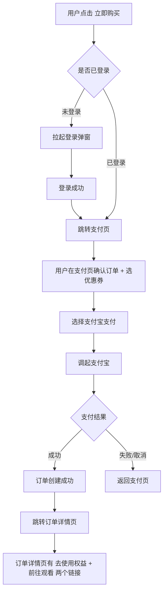

# 05-付费课程详情页

| 字段 | 内容 |
|---|---|
| 模块名称 | 付费课程详情页 |
| 业务归属 | 学习 Tab |
| 入口路径 | 付费课程列表 → 课程卡片 |
| 页面层级 | 三级 |
| 关联文档 | [04-付费课程列表](./04-付费课程列表.md)、[07-购买与订单](./07-购买与订单.md)、[08-个人学习中心](./08-个人学习中心.md) |
| 版本 | v1.0 |
| 最后更新 | 2026-05-06 |

---

## 1. 页面定位

付费课程详情页是用户购买决策的关键页面。展示课程完整信息、价格、可用优惠券、购买入口。

---

## 2. 入口与跳转

### 入口

- 付费课程列表 → 课程卡片
- 学习主页付费课程区 → 课程卡片

### 出口

| 出口 | 触发条件 |
|---|---|
| 支付页 | 用户点击"立即购买" |
| 个人学习中心 → 我的订单 | 已购课程，点击"查看订单" |
| 返回上一页 | 顶部返回按钮 |

---

## 3. 页面结构

### 3.1 整体布局

| 顺序 | 区域 | 说明 |
|---|---|---|
| 1 | 顶部导航栏 | 返回 + 标题"课程详情" |
| 2 | 课程封面区 | 封面图 + 课程类型标签 |
| 3 | 标题与定价区 | 课程名 + 账户权益说明 + 价格 + 优惠券提示 |
| 4 | 课程亮点 | 3-5 条核心亮点 |
| 5 | 课程目录 | 章节列表（标识免费 / 付费）|
| 6 | 课程详情 | 富文本介绍 |
| 7 | 底部固定区 | 价格 + 立即购买按钮（已购时变为"查看订单"）|

### 3.2 课程封面区

| 元素 | 说明 |
|---|---|
| 封面图 | 全宽展示，按 16:9 比例 |
| 课程类型标签 | 如"直升 → $10,000 账户" |
| 已购标签 | 已购买过的课程显示"已购买" |

### 3.3 标题与定价区

| 元素 | 说明 |
|---|---|
| 课程名 | 22px Semibold |
| 账户权益描述 | 如"购买后获得 $10,000 实训账户权益（一次性使用）"|
| 价格 | 大字号展示当前价格（如 "¥1,999"）|
| 优惠提示 | 如有可用优惠券，显示"有 1 张优惠券可用，最高优惠 ¥XXX" |
| 已购说明 | 已购用户：显示"你已购买过此课程，可重新购买再次获得权益" |

### 3.4 课程亮点

3-5 条核心亮点，每条用图标 + 一行文字呈现。例如：

- 系统化课程，X 个章节深度讲解
- 配套 X 万美金实训账户
- 专属火象证书认证
- 老师 1 对 1 答疑（如适用）

具体亮点内容由运营在后台配置。

### 3.5 课程目录

| 字段 | 说明 |
|---|---|
| 章节序号 | 1 / 2 / 3 ... |
| 章节标题 | 章节名 |
| 章节时长 | 如 "10:23" |
| 章节标签 | 免费 / 付费 |

V1 付费课的章节通过小鹅通观看，详细规则：

- 课程目录仅作展示，**章节本身不在 App 内播放**
- 用户购买后，进入订单详情页通过小鹅通链接观看完整课程
- 不支持试看（V1 简化）

### 3.6 课程详情（富文本）

运营在后台配置的富文本介绍，支持文字、图片、视频。

### 3.7 底部固定区

底部 56px 固定区，根据用户购买状态切换：

| 用户状态 | 底部区域内容 |
|---|---|
| 未购 | 左侧价格（含"原价 / 优惠后价格"）+ 右侧主按钮"立即购买" |
| 已购未使用权益 | 左侧"已购买"+ 右侧"查看订单" + 次按钮"再次购买" |
| 已购且权益已使用 | 左侧"已升级"+ 右侧"查看订单" + 次按钮"再次购买" |

---

## 4. 关键交互

### 4.1 立即购买流程

详细支付流程见 [07-购买与订单](./07-购买与订单.md)。

### 4.2 优惠券使用

- 详情页提示"有 X 张优惠券可用，最高优惠 ¥XXX"
- 实际选券在支付页（详见 [07-购买与订单](./07-购买与订单.md)）
- 优惠券类型：升级课程券、重训课程券（按课程类型自动匹配）

### 4.3 已购课程的处理

| 已购状态 | 详情页表现 |
|---|---|
| 已购未使用权益 | 顶部提示"你已购买过，权益尚未使用，可前往订单详情使用" + "查看订单"按钮 |
| 已购且权益已使用 | 顶部提示"你已购买过，权益已使用" + "查看订单"按钮 |

---

## 5. 异常态

| 异常 | 表现 | 处理 |
|---|---|---|
| 课程已下架 | 详情接口返回不存在 | 提示"课程已下架"，返回上一页 |
| 价格变动 | 用户看到旧价格点击购买 | 支付页校验最新价格，如不一致提示用户 |
| 网络不可用 | 详情加载失败 | 显示"加载失败，点击重试" |
| 优惠券已过期 | 详情页提示有可用券但实际过期 | 支付页选券时不展示已过期券 |

---

## 6. 接口约束

| 能力 | 说明 |
|---|---|
| 拉取课程详情 | 根据课程 ID 返回完整内容 |
| 拉取用户购买状态 | 返回该用户对该课程的购买记录 |
| 拉取可用优惠券 | 返回当前用户可用于该课程的优惠券（最优券）|

接口的具体定义、字段、协议由后端开发设计，本文档仅描述业务诉求。

---

## 7. 游客态

游客态可查看付费课程详情：

| 行为 | 游客态 |
|---|---|
| 浏览详情 | 可以 |
| 立即购买 | 触发[登录弹窗](../01-账号生命周期/03-登录弹窗.md) |

---

## 8. 合规要求

| 要求 | 说明 |
|---|---|
| 价格透明 | 课程价格、附加权益（账户）必须清晰展示 |
| 不夸大效果 | 课程描述不得包含"保证赚钱""稳赚不赔"等夸大文案 |
| 退款政策 | 课程详情页底部展示退款政策链接 |
| 资质合规 | 课程内容由运营审核合规后上线 |

---

## 9. V1 范围限制

| 功能 | 说明 |
|---|---|
| 章节试看 | V1 不支持 |
| 课程评价 | 不支持 |
| 收藏 | 不支持 |
| 分享课程 | V1 不支持 |
