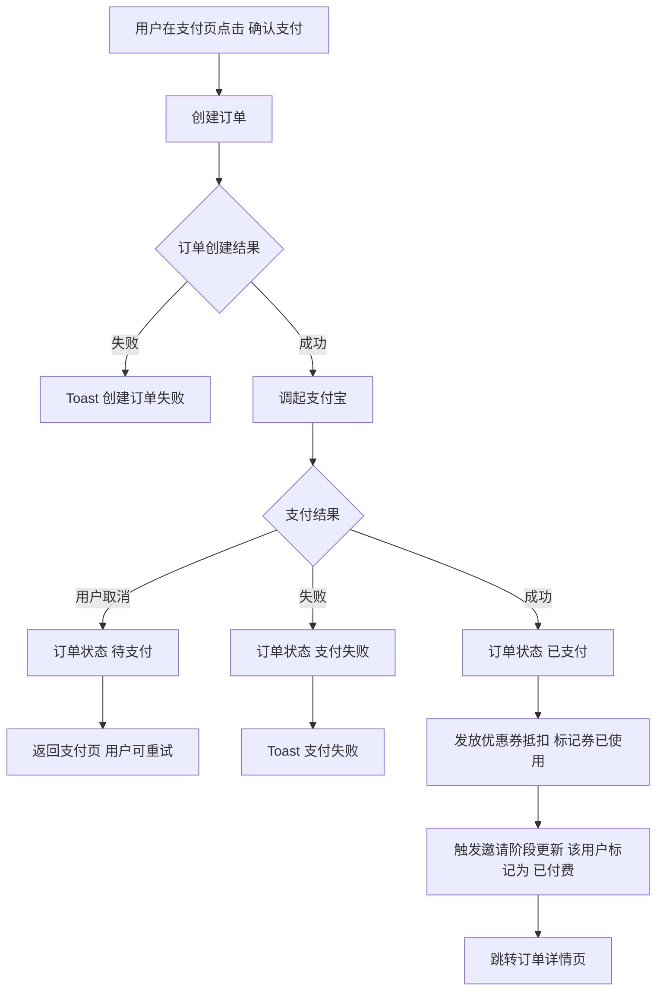
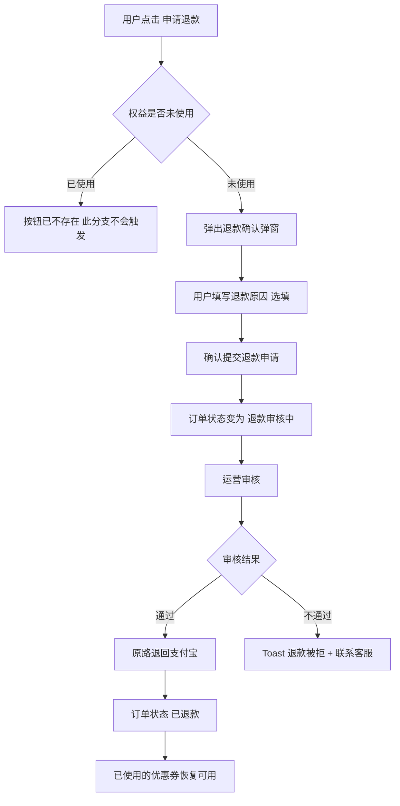

# 07-购买与订单

| 字段 | 内容 |
|---|---|
| 模块名称 | 购买与订单 |
| 业务归属 | 学习 Tab |
| 入口路径 | 付费课程详情页 → 立即购买 / 个人学习中心 → 我的订单 |
| 页面层级 | 三级（含支付页、订单详情、订单列表）|
| 关联文档 | [05-付费课程详情页](./05-付费课程详情页.md)、[08-个人学习中心](./08-个人学习中心.md) |
| 版本 | v1.0 |
| 最后更新 | 2026-05-06 |

---

## 1. 模块定位

本模块承载用户付费课程的**购买、支付、订单管理、退款**全流程。

V1 关键决策：

- 付费流程**在 App 内完成**（支付宝支付）
- iOS 端**不接入 Apple IAP**，上架时隐藏付费入口，过审后通过热更新开放（详细策略详见项目风险登记表）
- 课程内容观看在小鹅通（webview 内打开）
- 账户权益升级通过外部 H5 完成

---

## 2. 入口与跳转

### 入口

| 入口 | 触发场景 |
|---|---|
| 付费课程详情页 → 立即购买 | 进入支付页 |
| 个人学习中心 → 我的订单 | 进入订单列表 |
| 个人学习中心 → 我的订单 → 订单卡片 | 进入订单详情 |

### 出口

| 出口 | 触发条件 |
|---|---|
| 支付宝外部 App | 调起支付宝支付 |
| 小鹅通课程观看（webview）| 用户在订单详情点击"前往观看" |
| 账户权益升级 H5 | 用户在订单详情点击"去使用权益" |
| 客服 | 用户申请退款被拒后，找客服 |

---

## 3. 支付页

### 3.1 页面结构

| 区域 | 内容 |
|---|---|
| 顶部导航栏 | 返回 + 标题"确认订单" |
| 商品信息 | 课程封面 + 名称 + 账户权益说明 + 原价 |
| 优惠券抵扣 | 自动选择最优可用券 + 已优惠金额（用户可手动切换或不使用券）|
| 实付金额 | 大字号展示最终支付金额 |
| 支付方式 | "支付宝"（V1 唯一选项）|
| 协议同意 | 默认勾选"同意《课程购买协议》"，提供链接 |
| 主按钮 | "确认支付"（高度 48px，主色） |

### 3.2 优惠券选择

支付页提供"选择优惠券"入口：

| 元素 | 说明 |
|---|---|
| 默认行为 | 自动选择该课程可用的最优券（抵扣金额最大）|
| 用户切换 | 点击"选择优惠券"展开优惠券列表 |
| 不使用券 | 提供"不使用优惠券"选项 |
| 优惠券筛选 | 仅展示该课程可用的券（升级课券对应升级课、重训课券对应重训课）|

### 3.3 支付流程

### 3.4 支付异常处理

| 异常 | 处理 |
|---|---|
| 用户在支付宝中取消 | 订单保留，状态"待支付"，用户可在订单详情中重新支付 |
| 支付宝返回失败 | Toast 提示具体原因，用户可重试 |
| 订单创建失败 | Toast 提示，用户重试 |
| 网络中断 | 订单可能创建成功但 App 未收到回调，用户进入订单详情查看实际状态 |

---

## 4. 订单详情页

### 4.1 页面结构

| 区域 | 内容 |
|---|---|
| 顶部导航栏 | 返回 + 标题"订单详情" |
| 订单状态 | 状态标签（待支付 / 已支付 / 已退款 / 退款审核中）|
| 商品信息 | 课程封面 + 名称 + 账户权益 |
| 价格明细 | 原价 + 优惠券抵扣 + 实付金额 |
| 订单信息 | 订单号 / 创建时间 / 支付时间 / 支付方式 |
| 操作按钮区 | 按订单状态显示不同按钮 |

### 4.2 订单状态对应的按钮

| 订单状态 | 按钮 |
|---|---|
| 待支付 | "立即支付"（继续未完成的支付）|
| 已支付（权益未使用 + 课程未观看）| "去使用权益" + "前往观看" + "申请退款"（如适用）|
| 已支付（权益已使用 + 课程未观看）| "前往观看"（无退款按钮，权益已使用）|
| 已支付（权益未使用 + 课程已观看部分）| 同"已支付（权益已使用）"，但权益未使用，故有"去使用权益"按钮 |
| 已退款 | 显示"已退款"标签，无操作按钮 |
| 退款审核中 | 显示"退款审核中"，等待运营处理 |

> **关键说明**：
> - "去使用权益" → 跳转外部 H5 完成账户升级流程
> - "前往观看" → 在 App 内 webview 打开小鹅通课程页面
> - "申请退款" → 仅在权益未使用时显示

### 4.3 退款规则

V1 支持 App 内退款，但有严格条件：

| 条件 | 退款是否可申请 |
|---|---|
| 权益未使用（H5 未触发账户升级）| 可申请 |
| 权益已使用（H5 已触发账户升级）| 不可申请，按钮隐藏 |

> **课程观看不影响退款判定**：用户观看了课程，但权益未使用时仍可退款。
> 
> 后端通过状态判定：权益使用 = H5 状态返回的"已使用 / 未使用"。

### 4.4 退款流程

### 4.5 课程观看（前往观看）

用户在订单详情点击"前往观看"：

- 在 App 内打开 webview，加载小鹅通课程页面
- 不传递用户信息（用户在小鹅通独立操作 / 登录）
- webview 顶部提供返回按钮，用户可随时返回 App

### 4.6 权益使用（去使用权益）

用户在订单详情点击"去使用权益"：

- 跳转外部 H5（账户升级流程页面）
- App 端不参与 H5 内部流程
- H5 完成后，用户回到 App，订单详情自动刷新（权益状态更新）

---

## 5. 订单列表页（我的订单）

### 5.1 入口

个人学习中心 → 我的订单。

### 5.2 页面结构

| 区域 | 内容 |
|---|---|
| 顶部导航栏 | 返回 + 标题"我的订单" |
| 订单列表 | 用户所有订单按时间倒序展示 |

### 5.3 订单卡片字段

| 字段 | 说明 |
|---|---|
| 订单状态 | 待支付 / 已支付 / 已退款 / 退款审核中 |
| 课程封面 | 缩略图 |
| 课程名 | 课程名称 |
| 实付金额 | 用户实际支付金额 |
| 创建时间 | 订单创建时间 |
| 操作按钮 | 简化版（如待支付显示"继续支付"，已支付显示"查看详情"）|

### 5.4 加载与排序

| 项 | 规则 |
|---|---|
| 排序 | 创建时间倒序 |
| 默认加载 | 20 条 |
| 上拉加载 | 每次 20 条 |
| 下拉刷新 | 重新拉取 |

---

## 6. 异常态

| 异常 | 表现 | 处理 |
|---|---|---|
| 支付页订单创建失败 | 用户点击支付无响应 | Toast"创建订单失败，请重试" |
| 支付完成但回调未到 | 订单状态滞后 | 用户进入订单详情自动校验 + 刷新状态 |
| 退款审核失败 | 用户看到"退款审核中" | 运营处理后状态更新；用户可联系客服 |
| 订单列表加载失败 | 列表为空 | 显示"加载失败，下拉刷新重试" |
| webview 打开小鹅通失败 | 小鹅通页面无法加载 | 提示"加载失败，请检查网络后重试" |

---

## 7. 接口约束

| 能力 | 说明 |
|---|---|
| 创建订单 | 接收课程 ID + 优惠券 ID，返回订单号 + 支付参数 |
| 支付宝支付 | App 调起支付宝 SDK |
| 支付回调 | 后端接收支付宝回调，更新订单状态 |
| 拉取订单列表 | 分页拉取用户订单 |
| 拉取订单详情 | 根据订单 ID 拉取详情 + 权益使用状态 |
| 申请退款 | 提交退款申请，订单状态变为"退款审核中" |
| 查询权益状态 | 实时拉取该订单的权益使用状态（已使用 / 未使用）|

接口的具体定义、字段、协议由后端开发设计，本文档仅描述业务诉求。

---

## 8. 合规要求

| 要求 | 说明 |
|---|---|
| 用户协议同意 | 支付页必须勾选课程购买协议 |
| 价格明示 | 原价、优惠、实付金额清晰展示 |
| 退款政策 | 在课程详情页和支付页提供退款政策链接 |
| 发票申请 | 用户需开发票时联系客服处理（V1 不在 App 内提供开票入口）|
| iOS 上架风险 | iOS 端付费功能上架时隐藏，过审后热更新开放。**此策略存在审核合规风险，详见项目风险登记表** |

---

## 9. V1 范围限制

| 功能 | 说明 |
|---|---|
| Apple IAP | 不接入 |
| 微信支付 | 不接入（V1 仅支付宝）|
| App 内开票 | 不支持（联系客服）|
| 订单分享 | 不支持 |
| 订单导出 | 不支持 |
