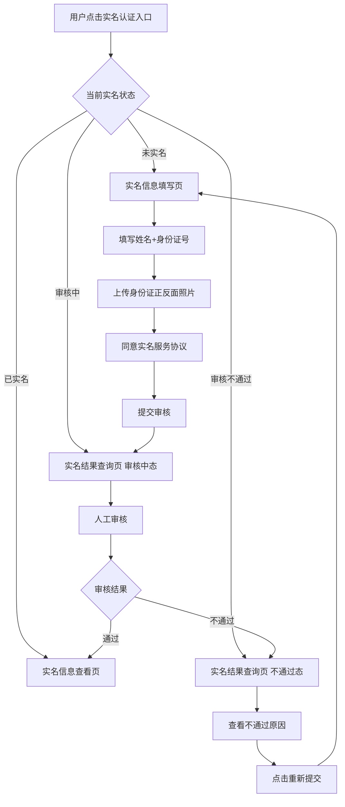

# 03-实名认证

| 字段 | 内容 |
|---|---|
| 模块名称 | 实名认证 |
| 业务归属 | 我的 Tab |
| 入口路径 | 我的主页头部实名状态 / 账号设置 → 实名认证 / 业务相关引导（如打款失败提示） |
| 页面层级 | 二级 |
| 关联文档 | [01-我的主页面](./01-我的主页面.md)、[02-账号设置](./02-账号设置.md)、[07-现金奖励中心](../04-训练Tab/07-现金奖励中心.md) |
| 版本 | v1.0 |
| 最后更新 | 2026-05-06 |

---

## 1. 模块定位

实名认证是用户提交真实身份信息进行核验的流程。3.0 中实名是**现金奖励打款**的前置条件——用户未实名时，运营审核环节将无法打款，但 App 内**不强制拦截用户做现金挑战**。

V1 实名认证为**人工审核**模式，后续可升级为 OCR + 人脸核身。

---

## 2. 入口与跳转

### 入口

| 入口 | 触发场景 |
|---|---|
| 我的主页头部 → 实名状态 | 用户主动入口 |
| 账号设置 → 实名认证 | 主动入口 |
| 现金奖励中心 → 流水"打款失败" → "去实名" | 业务关联引导 |

### 出口

| 出口 | 触发条件 |
|---|---|
| 返回上一页 | 用户主动返回 |
| 实名结果查询页 | 用户提交认证后 |
| 重新提交流程 | 审核不通过的用户 |

---

## 3. 实名认证流程

### 3.1 整体流程图

---

## 4. 实名信息填写页

### 4.1 页面结构

| 区域 | 内容 |
|---|---|
| 顶部导航栏 | 返回 + 标题"实名认证" |
| 说明文字 | 简短说明实名用途（如"为保障您的现金奖励正常发放，请提交实名信息"） |
| 表单区 | 真实姓名、身份证号、身份证照片 |
| 协议勾选 | 同意《实名认证服务协议》 |
| 主按钮 | "提交审核" |

### 4.2 表单字段

| 字段 | 输入规则 |
|---|---|
| 真实姓名 | 2-30 个字符，仅中文 |
| 身份证号 | 18 位，含字母 X，前端校验格式 |
| 身份证正面照片 | 上传，必填 |
| 身份证反面照片 | 上传，必填 |

### 4.3 照片上传规则

| 项 | 规则 |
|---|---|
| 来源 | 拍照 / 从相册选择 |
| 格式 | JPG / PNG |
| 大小限制 | 单张 ≤ 10MB |
| 数量 | 正反面各 1 张 |
| 预览 | 上传后可预览，可重新上传 |
| 提示 | "请确保身份证清晰可见，无遮挡" |

### 4.4 提交校验

| 校验项 | 规则 |
|---|---|
| 必填项 | 姓名、身份证号、正反面照片 |
| 身份证号格式 | 前端校验 18 位 + 校验位算法 |
| 协议勾选 | 必须勾选 |

校验通过后调用提交接口，返回成功后跳转到实名结果查询页（"审核中"态）。

---

## 5. 实名结果查询页

### 5.1 审核中态

| 区域 | 内容 |
|---|---|
| 顶部 | 返回 + 标题"实名认证" |
| 状态展示 | 大图标 + "实名审核中" |
| 说明文字 | "材料已提交，预计 1 个工作日内完成审核。审核结果将通过站内信通知。" |
| 按钮 | 无 |

### 5.2 审核不通过态

| 区域 | 内容 |
|---|---|
| 顶部 | 返回 + 标题"实名认证" |
| 状态展示 | 大图标 + "实名认证未通过" |
| 不通过原因 | 后端返回的具体原因（如"身份证照片模糊，请重新上传"）|
| 主按钮 | "重新提交"（跳转实名信息填写页，原数据可清空或保留 [由产品决定]）|

---

## 6. 实名信息查看页（已实名）

| 区域 | 内容 |
|---|---|
| 顶部 | 返回 + 标题"实名认证" |
| 状态展示 | 大图标 + "实名认证已完成" |
| 信息展示 | 真实姓名（脱敏，如"张**"）+ 身份证号（脱敏，如 "110****0001"）|
| 提示 | "如需修改实名信息，请联系客服" |
| 按钮 | 无（V1 不支持修改）|

---

## 7. 关键交互

### 7.1 协议链接

"实名认证服务协议"为可点击链接，点击跳转协议详情。协议内容由合规提供。

### 7.2 提交后的状态推送

V1 不主动推送，用户通过以下方式获知审核结果：

- 用户主动进入实名页查看
- 通过站内信通知（运营手动发布）

> 注：V1 站内信仅运营手动发布，不支持系统自动消息。审核完成的提示由运营或后端定期发送。

### 7.3 中途返回

用户在实名信息填写页中途返回：

- 已输入的信息不保留（避免敏感信息缓存）
- 已上传的照片不保留

---

## 8. 异常态

| 异常 | 表现 | 处理 |
|---|---|---|
| 网络异常 | 提交失败 | Toast"网络异常，请检查网络后重试" |
| 照片上传失败 | 照片位置显示"上传失败" | 提示重新上传 |
| 身份证号格式错误 | 前端校验 | 输入框下方红色提示 |
| 提交接口失败 | 后端 5xx | Toast"提交失败，请稍后重试" |
| 重复提交 | 用户已在审核中再次提交 | 提示"实名审核中，请耐心等待" |
| 后端返回风控错误 | 如该身份证已被其他账号实名 | 提示"该身份证已实名其他账号" |

---

## 9. 接口约束

| 能力 | 说明 |
|---|---|
| 拉取实名状态 | 返回当前用户的实名状态 + 信息（脱敏） |
| 上传身份证照片 | 上传到云存储，返回 URL |
| 提交实名认证 | 提交完整信息（姓名、身份证号、照片 URL）|
| 拉取实名结果 | 用于结果查询页 |

接口的具体定义、字段、协议由后端开发设计，本文档仅描述业务诉求。

---

## 10. 合规要求

| 要求 | 说明 |
|---|---|
| 实名信息加密存储 | 后端必须加密存储姓名、身份证号、照片 |
| 数据脱敏 | 前端展示必须脱敏（仅显示首字 + 末字）|
| 协议告知 | 提交前必须勾选实名服务协议 |
| 数据使用范围 | 实名信息仅用于身份核验，不得用于其他用途 |
| 数据存储期限 | 按合规要求，用户注销后匿名化处理 |
| 不得过度收集 | V1 不收集人脸数据，仅身份证信息（OCR / 人脸核身为后续功能） |

---

## 11. V1 范围限制

| 功能 | 说明 |
|---|---|
| OCR 自动识别 | V1 不做（人工审核）|
| 人脸核身 | V1 不做 |
| 修改实名信息 | V1 不支持，需联系客服 |
| 实名后的特权展示 | V1 不专门展示实名特权（如积分加成等）|
| 港澳台 / 国外身份证件 | V1 仅支持大陆居民身份证 |
