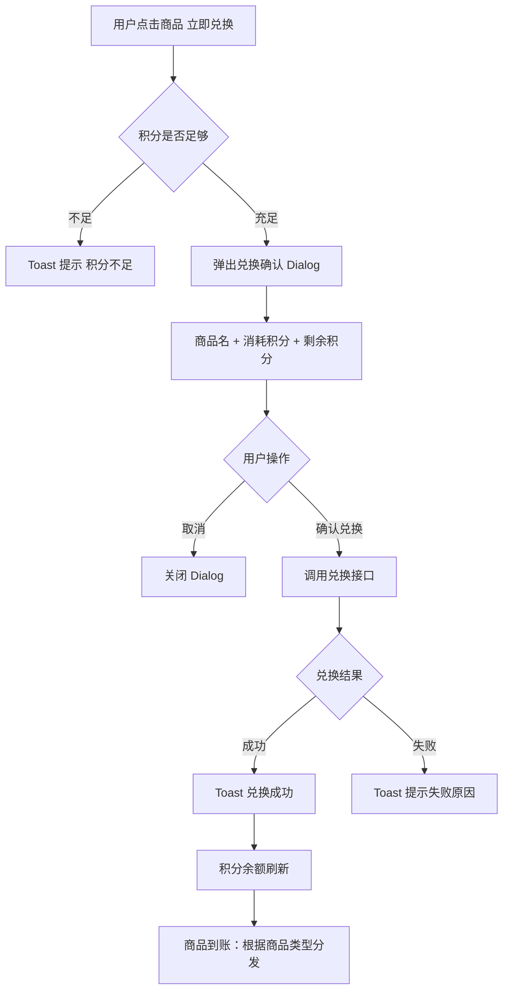

# 04-积分商城

| 字段 | 内容 |
|---|---|
| 模块名称 | 积分商城 |
| 业务归属 | 我的 Tab |
| 入口路径 | 我的主页 → 顶部资产数据卡 → 积分 / 我的主页 → 业务入口网格 → 积分商城 |
| 页面层级 | 二级 |
| 关联文档 | [01-我的主页面](./01-我的主页面.md)、[09-账户详情页](../04-训练Tab/09-账户详情页.md) |
| 版本 | v1.0 |
| 最后更新 | 2026-05-06 |

---

## 1. 模块定位

积分商城是用户使用积分兑换权益的页面。3.0 中积分是 4 条独立奖励流之一（与 XP / 现金奖励 / 补贴金独立）。

V1 积分商城支持的兑换权益：

| 商品 | 用途 |
|---|---|
| 模拟重置卡 | 重置整个模拟账户（恢复 50 万人民币初始）|
| 升级账户课程券（多种规模）| 用于购买对应规模升级课时抵扣 |
| 重训课程券 | 用于购买重训课时抵扣 |
| 任务重置卡（如适用）| 重置当前进行中任务的失败冷却 [V1 是否启用待对齐] |
| 其他 | 由运营在后台配置 |

---

## 2. 入口与跳转

### 入口

| 入口 | 触发场景 |
|---|---|
| 我的主页 → 资产数据卡 → 积分卡片 | 主入口 |
| 我的主页 → 业务入口网格 → 积分商城 | 主入口 |
| 训练页 → 模拟账户重置（如积分不足）| 业务关联 |

### 出口

| 出口 | 触发条件 |
|---|---|
| 积分明细页 | 用户点击"积分明细"链接 |
| 商品详情 / 兑换确认 | 用户点击商品卡片 |
| 我的兑换记录 | 用户点击"我的兑换" |
| 返回上一页 | 顶部返回按钮 |

---

## 3. 页面结构

### 3.1 整体布局

| 顺序 | 区域 | 说明 |
|---|---|---|
| 1 | 顶部导航栏 | 返回 + 标题"积分商城" + 右上角"我的兑换" |
| 2 | 积分概览区 | 当前积分余额 + "积分明细"链接 |
| 3 | 商品分类（如适用） | V1 是否分类 [待对齐]，建议不分 |
| 4 | 商品列表 | 商品卡片列表 |

### 3.2 积分概览区

| 元素 | 内容 |
|---|---|
| 标题 | "我的积分" |
| 数字 | 当前积分余额（大字号 24px DINPro Bold）|
| 链接 | "积分明细 →"（点击进入积分明细页）|

视觉规则：

- 区域背景使用主色渐变或品牌图，突出感
- 数字使用主色 `#E72737` 或对比色
- 整体卡片高度约 100px

### 3.3 商品列表

每个商品一张卡片，2 列网格布局：

| 字段 | 说明 |
|---|---|
| 商品图 | 商品配图 / 默认图标 |
| 商品名 | 如"模拟重置卡" |
| 商品简介 | 一行简短说明 |
| 兑换价格 | 如 "20 积分" |
| 库存（如限量）| 如 "剩余 99 件" |
| 主按钮 | "立即兑换"（积分不足时置灰）|

---

## 4. 兑换流程

### 4.1 流程图



### 4.2 兑换确认 Dialog

```
弹窗：
  标题：确认兑换
  正文：
    商品：[商品名]
    消耗：X 积分
    兑换后剩余：Y 积分
  按钮：取消 / 确认兑换
```

### 4.3 兑换后商品到账

不同商品兑换后到账方式不同：

| 商品类型 | 到账方式 |
|---|---|
| 模拟重置卡 | 入账到用户卡券包（待用），训练页/模拟账户详情可使用 |
| 课程券 | 入账到优惠券包（学习 Tab → 我的优惠券）|
| 任务重置卡（如启用）| 入账到卡券包，任务详情半框可使用 |
| 其他 | 按商品类型决定 |

兑换成功后页面：

- 商品列表的库存数 -1
- 用户积分余额 - 商品价格
- Toast 提示"兑换成功，[商品名] 已到账"

### 4.4 库存不足

| 场景 | 处理 |
|---|---|
| 商品已下架 | 商品卡片不展示 |
| 库存为 0 | 商品卡片置灰 + "已兑完" |
| 兑换瞬间库存被抢光 | 后端返回库存不足，Toast 提示 |

---

## 5. 积分明细页

### 5.1 页面结构

| 区域 | 内容 |
|---|---|
| 顶部 | 返回 + 标题"积分明细" |
| 概览 | 当前积分余额 |
| 列表 | 积分变动记录 |

### 5.2 积分明细卡片

每条记录展示：

| 字段 | 说明 |
|---|---|
| 类型 | 收入 / 支出 |
| 来源 / 用途 | 如"完成任务奖励"、"兑换模拟重置卡"|
| 时间 | 时间戳 |
| 金额 | 收入显示"+50"，支出显示"-20"（颜色区分）|

### 5.3 加载策略

- 默认按时间倒序
- 默认加载 20 条
- 上拉加载更多
- 下拉刷新

---

## 6. 我的兑换记录页

### 6.1 页面结构

| 区域 | 内容 |
|---|---|
| 顶部 | 返回 + 标题"我的兑换" |
| 列表 | 用户所有兑换记录 |

### 6.2 兑换记录卡片

| 字段 | 说明 |
|---|---|
| 商品图 | 缩略图 |
| 商品名 | 商品名称 |
| 兑换时间 | 时间戳 |
| 消耗积分 | 如"-20 积分" |
| 状态 | 已发放 / 已使用 / 已过期（如适用）|

### 6.3 加载策略

- 按兑换时间倒序
- 默认加载 20 条
- 上拉加载更多

---

## 7. 关键规则

### 7.1 积分获取来源

V1 积分获取来源：

| 来源 | 说明 |
|---|---|
| 完成任务奖励 | 部分任务完成后获得积分（详见任务体系）|
| 升级赠礼 | 用户升级时发放积分（详见等级权益配置）|
| 活动奖励 | 运营活动中获得 |
| 其他 | 运营手动发放 |

> 积分**永不过期**（V1 简化）。

### 7.2 兑换规则

| 项 | 规则 |
|---|---|
| 兑换条件 | 积分余额 ≥ 商品价格 |
| 兑换数量 | V1 默认每次兑换 1 件 |
| 兑换次数限制 | 由后台按商品配置（如某商品每用户限兑 1 次）|
| 兑换后取消 | V1 不支持取消兑换 |

### 7.3 积分使用范围

积分仅可在积分商城内兑换商品，**不可提现、不可转赠**。

---

## 8. 异常态

| 异常 | 表现 | 处理 |
|---|---|---|
| 商品列表加载失败 | 列表为空 | 显示"加载失败，下拉刷新重试" |
| 兑换接口失败 | Toast"兑换失败" | 用户重试 |
| 积分余额异常 | 显示 "--" | 后端排查，前端兜底显示最近一次成功值 |
| 库存被抢光 | 兑换瞬间失败 | Toast"商品已兑完" |
| 网络异常 | 全部失败 | 显示重试入口 |

---

## 9. 接口约束

| 能力 | 说明 |
|---|---|
| 拉取积分余额 | 返回当前用户积分 |
| 拉取商品列表 | 返回当前生效的商品 |
| 兑换商品 | 接收商品 ID，校验积分 + 库存，扣减积分 + 发放商品 |
| 拉取积分明细 | 分页返回积分变动记录 |
| 拉取兑换记录 | 分页返回用户兑换历史 |

接口的具体定义、字段、协议由后端开发设计，本文档仅描述业务诉求。

---

## 10. V1 范围限制

| 功能 | 说明 |
|---|---|
| 积分排行榜 | 不支持 |
| 积分转赠 | 不支持 |
| 积分提现 | 不支持 |
| 积分过期 | V1 永不过期 |
| 商品评价 | 不支持 |
| 商品详情页（独立页）| V1 简化为兑换确认 Dialog，无独立详情页 |
| 商品分类筛选 | V1 不分类（商品数量少）|
| 商品搜索 | 不支持 |
