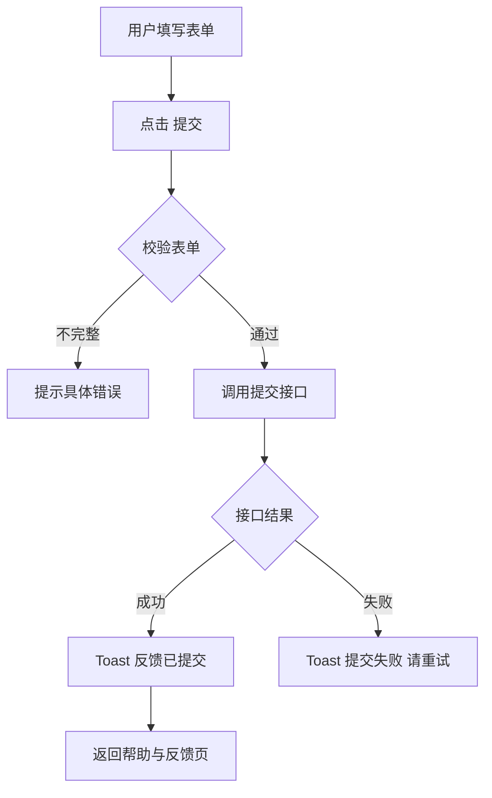

# 06-帮助与反馈

| 字段 | 内容 |
|---|---|
| 模块名称 | 帮助与反馈 |
| 业务归属 | 我的 Tab |
| 入口路径 | 我的主页 → 设置入口列表 → 帮助与反馈 |
| 页面层级 | 二级 |
| 关联文档 | [01-我的主页面](./01-我的主页面.md) |
| 版本 | v1.0 |
| 最后更新 | 2026-05-06 |

---

## 1. 模块定位

帮助与反馈页是用户获取支持和反馈意见的统一入口。V1 包含两个核心功能：

1. **在线客服**：用户通过第三方客服系统获得即时支持（FAQ 由客服后台配置，App 内不重复维护）
2. **意见反馈**：用户通过表单提交意见、问题、建议

---

## 2. 入口与跳转

### 入口

- 我的主页 → 设置入口列表 → 帮助与反馈

### 出口

| 出口 | 触发条件 |
|---|---|
| 在线客服（第三方 SDK 或 webview） | 用户点击"联系客服" |
| 意见反馈表单页 | 用户点击"意见反馈" |
| 返回我的页 | 顶部返回按钮 |

---

## 3. 页面结构

### 3.1 整体布局

| 顺序 | 区域 | 说明 |
|---|---|---|
| 1 | 顶部导航栏 | 返回 + 标题"帮助与反馈" |
| 2 | 主入口区 | 联系客服 + 意见反馈 |

### 3.2 主入口区

两个大型卡片或入口：

| 入口 | 描述 | 跳转 |
|---|---|---|
| 联系客服 | "在线客服为您解答疑问" + 客服图标 | 调起第三方客服 |
| 意见反馈 | "您的建议是我们前进的动力" + 反馈图标 | 跳转意见反馈表单页 |

视觉规则：

- 两个入口可并排或上下展示
- 卡片圆角 12px，背景白色
- 图标 32px

---

## 4. 在线客服

### 4.1 客服承载方

V1 接入第三方客服系统 **[沿用 2.0 已接入方案 / 待技术对齐]**。常见方案：

- 客服 SDK（如美洽、容联七陌等）：调起客服界面
- WebView：在 webview 内加载客服 H5

### 4.2 用户体验

| 项 | 规则 |
|---|---|
| 接入方式 | 第三方 SDK 或 webview（具体实现 [待技术对齐]） |
| FAQ | 由客服后台配置，无需 App 内重复维护 |
| 用户身份 | App 端可向客服系统传递必要的用户信息（如用户 ID、昵称、登录态等），便于客服快速定位用户问题 |
| 工单系统 | 由客服系统自带，App 端不维护 |

### 4.3 跳转客服

| 步骤 | 行为 |
|---|---|
| 用户点击"联系客服" | 检查客服 SDK 是否可用 |
| SDK 可用 | 直接调起客服界面 |
| SDK 不可用 / 异常 | 降级方案：跳 webview 加载客服 H5 |
| 用户在客服界面操作 | 与客服交互，发送消息、查看 FAQ 等 |
| 用户返回 | 关闭客服界面，回到帮助与反馈页 |

---

## 5. 意见反馈

### 5.1 意见反馈表单页

| 区域 | 内容 |
|---|---|
| 顶部导航栏 | 返回 + 标题"意见反馈" |
| 反馈类型 | 单选：功能建议 / 体验问题 / Bug 报告 / 其他 |
| 反馈内容 | 文本输入框，支持多行 |
| 图片上传 | 最多 3 张，可选 |
| 联系方式（可选）| 用户预留手机号 / 邮箱（默认填充已绑定的手机号）|
| 主按钮 | "提交"（高度 48px，主色）|

### 5.2 字段规则

| 字段 | 规则 |
|---|---|
| 反馈类型 | 必选 |
| 反馈内容 | 必填，10-500 字 |
| 图片上传 | 可选，最多 3 张，单张 ≤ 5MB，格式 JPG / PNG |
| 联系方式 | 可选，自动填充用户绑定手机号，可修改 |

### 5.3 提交流程

### 5.4 提交后

| 项 | 行为 |
|---|---|
| Toast 提示 | "反馈已提交，我们会尽快处理" |
| 跳转 | 自动返回帮助与反馈页 |
| 用户后续查询 | V1 不提供"我的反馈记录"页（用户提交即结束） |

> **关于反馈记录**：V1 不在 App 内展示用户的反馈历史。运营在后台处理用户反馈，必要时通过站内信回复用户。

---

## 6. 异常态

| 异常 | 表现 | 处理 |
|---|---|---|
| 客服 SDK 加载失败 | 用户点击客服无响应 | 降级到 webview 加载客服 H5 |
| 客服 H5 加载失败 | 客服界面空白 | Toast"客服系统暂不可用，请稍后重试" |
| 反馈提交失败 | 后端 5xx | Toast"提交失败，请稍后重试" |
| 图片上传失败 | 图片位置 | 提示重新上传 |
| 网络异常 | 全部失败 | 显示重试入口 |

---

## 7. 接口约束

| 能力 | 说明 |
|---|---|
| 提交意见反馈 | 接收反馈类型、内容、图片、联系方式 |
| 上传反馈图片 | 上传到云存储，返回 URL |
| 客服 SDK 配置 | 客服系统相关配置（Token、用户标识等）|

接口的具体定义、字段、协议由后端开发设计，本文档仅描述业务诉求。

---

## 8. 合规要求

| 要求 | 说明 |
|---|---|
| 客服信息合规 | 客服系统的合规由第三方客服系统负责 |
| 反馈内容审核 | 后端对用户提交的反馈进行内容审核（避免恶意刷量）|
| 联系方式存储 | 用户提交的联系方式仅用于反馈相关沟通，不得用于营销 |

---

## 9. V1 范围限制

| 功能 | 说明 |
|---|---|
| App 内 FAQ | 不维护（FAQ 由客服后台配置）|
| 我的反馈记录 | 不展示 |
| 客服满意度评价 | V1 不在 App 内做（由第三方客服系统自带）|
| 工单管理 | 由第三方客服系统承载 |
| 视频反馈 | 不支持，仅文字 + 图片 |
