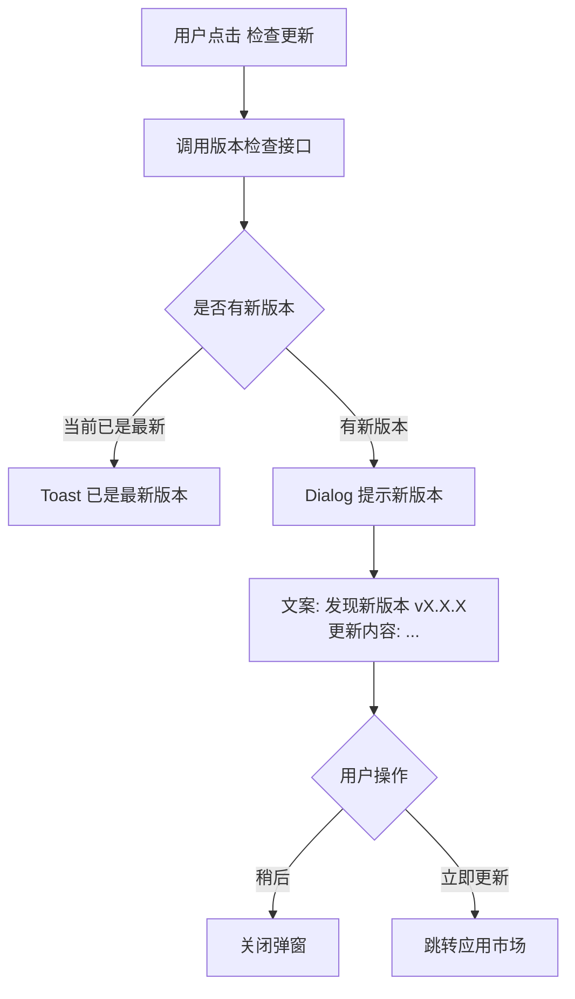

# 07-关于我们

| 字段 | 内容 |
|---|---|
| 模块名称 | 关于我们 |
| 业务归属 | 我的 Tab |
| 入口路径 | 我的主页 → 设置入口列表 → 关于我们 |
| 页面层级 | 二级 |
| 关联文档 | [01-我的主页面](./01-我的主页面.md)、[01-启动页](../01-账号生命周期/01-启动页.md) |
| 版本 | v1.0 |
| 最后更新 | 2026-05-06 |

---

## 1. 模块定位

关于我们页是 App 的版本信息、协议、合规信息聚合页，承担合规告知、版本检查、协议查看等功能。

V1 的关于我们页满足应用市场审核合规要求，包含**第三方 SDK 说明、个人信息收集清单**等关键合规信息。

---

## 2. 入口与跳转

### 入口

- 我的主页 → 设置入口列表 → 关于我们

### 出口

| 出口 | 触发条件 |
|---|---|
| 用户协议详情页 | 用户点击"用户协议" |
| 隐私政策详情页 | 用户点击"隐私政策" |
| 第三方 SDK 列表 | 用户点击"第三方 SDK 说明" |
| 个人信息收集清单 | 用户点击"个人信息收集清单" |
| 应用市场（更新）| 检查到新版本时 |
| 返回我的页 | 顶部返回按钮 |

---

## 3. 页面结构

### 3.1 整体布局

| 顺序 | 区域 | 说明 |
|---|---|---|
| 1 | 顶部导航栏 | 返回 + 标题"关于我们" |
| 2 | 顶部品牌区 | Logo + App 名称 + 版本号 |
| 3 | 公司介绍 | 简短介绍 |
| 4 | 设置项列表 | 各类合规与设置项 |
| 5 | 底部 | 版权 + 备案号 + 联系方式 |

### 3.2 顶部品牌区

| 元素 | 内容 |
|---|---|
| Logo | 火象 Logo（圆形或圆角矩形）|
| App 名称 | "火象" |
| 版本号 | 当前 App 版本（如 "v3.0.1"）|

### 3.3 公司介绍

简短介绍文案 **[待运营/品牌方提供]**，描述公司定位、产品理念。

约 100-200 字，富文本展示。

### 3.4 设置项列表

每行一个设置项，左标签 + 右值或箭头：

| 项 | 内容 / 跳转 |
|---|---|
| 检查更新 | 当前版本号 + "检查更新"操作 |
| 用户协议 | 跳转协议详情页 |
| 隐私政策 | 跳转协议详情页 |
| 第三方 SDK 说明 | 跳转 SDK 列表页 |
| 个人信息收集清单 | 跳转清单页 |
| 联系我们 | 展示客服电话 / 邮箱 |

### 3.5 底部信息

| 元素 | 内容 |
|---|---|
| 公司全称 | "[公司全称]" **[待提供]** |
| 备案号 | ICP 备案号 + 公安备案号 **[待提供]** |
| 版权声明 | "© 2026 [公司名] 版权所有" |

---

## 4. 关键功能

### 4.1 检查更新

用户点击"检查更新"：

强更逻辑由启动页统一处理（详见 [01-启动页](../01-账号生命周期/01-启动页.md)）。关于我们页的检查更新仅手动触发。

### 4.2 用户协议 / 隐私政策

跳转协议详情页（H5 或独立页）：

- 协议内容由后端动态返回
- 支持长按选择文字
- 支持滚动浏览

### 4.3 第三方 SDK 说明

合规要求展示 App 中使用的所有第三方 SDK：

| 字段 | 说明 |
|---|---|
| SDK 名称 | 如 "微信支付 SDK" |
| 提供方 | 如 "腾讯科技"|
| 用途 | 如 "用于微信支付" |
| 收集信息 | 如 "设备信息、IP 地址" |
| 隐私政策链接 | 跳转该 SDK 提供方的隐私政策 |

V1 至少包含的 SDK：

- 一键登录 SDK（运营商认证）
- 支付宝 SDK
- 阿里云视频播放 SDK
- 客服 SDK（沿用 2.0）
- 推送 SDK（如适用）
- 数据统计 SDK（如友盟、神策）
- 微信开放 SDK（用于分享）
- 其他 **[待技术清单完整列出]**

### 4.4 个人信息收集清单

合规要求明示 App 收集的所有个人信息：

| 字段 | 说明 |
|---|---|
| 信息类型 | 如 "手机号"、"身份证号"、"实名照片" |
| 收集场景 | 如 "登录注册"、"实名认证" |
| 使用目的 | 如 "用户身份识别"、"现金奖励打款" |
| 第三方共享 | 是否共享给第三方，共享给谁 |
| 存储期限 | 数据保留多久 |

V1 至少包含的信息：

- 手机号（登录注册）
- 实名信息（身份证号、姓名、照片）
- 设备信息（设备 ID、IP、型号）
- 用户行为（任务完成、订单等）
- 头像（如用户上传）
- 其他 **[由合规整理完整清单]**

### 4.5 联系我们

展示客服联系方式：

| 方式 | 内容 |
|---|---|
| 客服电话 | "[客服电话]" **[待提供]** |
| 客服邮箱 | "[客服邮箱]" **[待提供]** |
| 客服微信 | "[客服微信号]" **[待提供]** |
| 工作时间 | "[工作时间]" **[待提供]** |

> 在线客服入口在 [06-帮助与反馈](./06-帮助与反馈.md) 提供，本页仅展示线下联系方式。

---

## 5. 异常态

| 异常 | 表现 | 处理 |
|---|---|---|
| 检查更新接口失败 | 检查无响应 | Toast"检查失败，请稍后重试" |
| 协议详情加载失败 | 协议页空白 | 显示"加载失败，点击重试" |
| 公司介绍加载失败 | 介绍区为空 | 显示默认文案兜底 |

---

## 6. 接口约束

| 能力 | 说明 |
|---|---|
| 检查版本更新 | 返回最新版本号 + 更新内容 |
| 拉取协议详情 | 返回当前生效的协议版本与内容 |
| 拉取 SDK 列表 | 返回当前 App 使用的 SDK 信息 |
| 拉取个人信息清单 | 返回当前收集的个人信息说明 |

接口的具体定义、字段、协议由后端开发设计，本文档仅描述业务诉求。

---

## 7. 合规要求

| 要求 | 说明 |
|---|---|
| 协议必须可达 | 用户协议、隐私政策必须在 App 内可查看 |
| 第三方 SDK 透明 | 必须列出所有使用的第三方 SDK 及其用途 |
| 个人信息明示 | 必须列出收集的所有个人信息及用途 |
| 备案号展示 | ICP 备案号、公安备案号必须展示 |
| 公司信息真实 | 公司全称、联系方式必须真实可查 |
| 协议版本管理 | 协议变更后用户需重新同意（详见 [01-启动页](../01-账号生命周期/01-启动页.md)）|

---

## 8. V1 范围限制

| 功能 | 说明 |
|---|---|
| App 评分 | V1 不引导评分（避免应用市场刷分嫌疑）|
| 应用市场跳转评分 | V1 不做 |
| 关于我们的多语言 | V1 仅简体中文 |
| 公司动态展示 | 不在关于我们页展示 |
| 团队介绍 | 不展示 |
