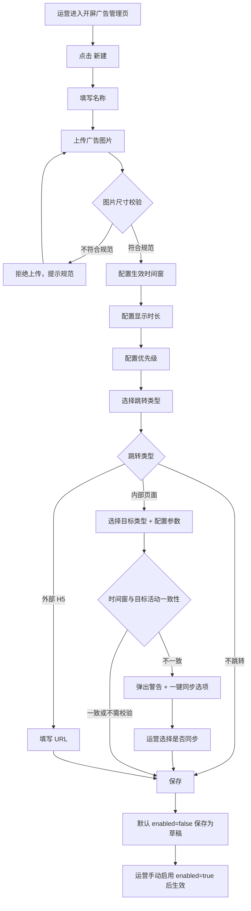

# 01-开屏广告配置

| 字段 | 内容 |
|---|---|
| 模块名称 | 开屏广告配置 |
| 业务归属 | 运营配置体系 |
| 文档定位 | 描述开屏广告的后台配置项、生效规则、与用户端的契约 |
| 关联文档 | [运营配置总览](./00-总览.md)、[02-开屏广告（用户端）](../01-账号生命周期/02-开屏广告.md)、[01-启动页](../01-账号生命周期/01-启动页.md) |
| 版本 | v1.0 |
| 最后更新 | 2026-04-30 |

---

## 1. 配置定位

开屏广告是用户每次冷启动 App 后展示的全屏广告位。本配置定义"一条开屏广告记录"的字段、生效规则、运营操作场景。

用户端展示规则详见 [开屏广告（用户端）](../01-账号生命周期/02-开屏广告.md)。

---

## 2. 配置数据结构

### 2.1 字段清单

| 字段 | 类型 | 必填 | 说明 |
|---|---|---|---|
| id | string | 是 | 配置唯一标识，系统生成 |
| name | string | 是 | 配置名称（仅运营后台展示，不展示给用户）。最大 50 字 |
| enabled | boolean | 是 | 启用状态。默认 false（创建后默认为草稿态） |
| start_time | datetime | 是 | 生效开始时间（精确到秒，UTC+8） |
| end_time | datetime | 是 | 生效结束时间（精确到秒，UTC+8） |
| priority | int | 是 | 优先级，整数。数值越大优先级越高。默认 0 |
| image_url | string | 是 | 广告图片资源 URL（CDN 地址） |
| image_size | string | 否 | 图片实际尺寸，记录字段，便于审核 |
| display_duration | int | 是 | 显示时长，单位秒。范围 3-5。默认 3 |
| skip_button_enabled | boolean | 是 | 是否显示跳过按钮。**固定为 true**，合规要求 |
| jump_type | enum | 是 | 跳转类型：`none` / `internal` / `external_h5` |
| jump_target | string | 否 | 跳转目标。`jump_type=none` 时为空；`internal` 时为内部页面路由；`external_h5` 时为完整 URL |
| jump_params | object | 否 | 跳转参数（如 `internal` 类型跳转活动详情时的活动 ID） |
| created_at | datetime | 是 | 创建时间，系统自动 |
| created_by | string | 是 | 创建人，系统自动 |
| updated_at | datetime | 是 | 更新时间，系统自动 |
| updated_by | string | 是 | 更新人，系统自动 |

### 2.2 跳转类型详解

| 跳转类型 | 说明 | jump_target 示例 |
|---|---|---|
| `none` | 不跳转，仅展示 | （为空） |
| `internal` | 跳转 App 内部页面 | `activity_detail`、`course_detail`、`level_detail`、`task_list` |
| `external_h5` | 跳转外部 H5 页面 | `https://example.com/activity/123` |

### 2.3 内部跳转的目标类型

`jump_type=internal` 时，`jump_target` 取值范围与 `jump_params` 对应字段：

| jump_target | jump_params 字段 | 说明 |
|---|---|---|
| activity_detail | activity_id | 跳转活动详情页 |
| course_detail | course_id | 跳转课程详情页 |
| level_detail | level | 跳转等级详情页（指定等级） |
| current_task | （无） | 跳转当前进行中任务（无任务时跳训练页） |
| task_list | （无） | 跳转训练页 |
| invite_center | （无） | 跳转邀请中心 |
| cash_reward_center | （无） | 跳转现金奖励中心 |
| custom | url | 兜底，跳转 App 内通用页面 |

> 内部跳转目标的扩展由后续业务需求驱动，新增类型时同步更新本文档。

---

## 3. 生效规则

### 3.1 单条配置生效

一条配置同时满足以下所有条件时，对用户生效：

1. `enabled = true`
2. 当前时间在 `[start_time, end_time]` 区间内（含两端）
3. `image_url` 资源可加载
4. `jump_type=internal` 且 `jump_target` 指向的目标可用（如活动未下线）

### 3.2 多条配置共存时的选择

App 端在启动时请求"当前生效的开屏广告"，服务端返回逻辑：

1. 筛选所有满足"单条生效条件"的配置
2. 按 `priority` 降序排序
3. 同 `priority` 按 `created_at` 倒序
4. 返回第 1 条

App 端单次启动**仅展示 1 条广告，不轮播**。

### 3.3 紧急下线

运营可通过手动将 `enabled` 改为 `false` 立即下线，无需等待 `end_time`。

---

## 4. 运营操作场景

### 4.1 创建新配置

### 4.2 编辑配置

- 已生效配置可被编辑
- 编辑保存后立即生效（用户下次请求时获取新配置）
- 已在客户端展示中的广告不强制刷新

### 4.3 一键同步活动时间

当 `jump_type=internal` 且 `jump_target=activity_detail` 时：

- 后台检测 banner 时间窗与活动时间窗是否一致
- 不一致时弹出警告："此 banner 时间窗与目标活动 [活动名称] 时间窗不一致（活动时间：YYYY-MM-DD ~ YYYY-MM-DD）。是否同步？"
- 提供"一键同步活动时间"按钮
- 警告**不阻止**保存，运营可保留差异

### 4.4 删除 vs 下线

| 操作 | 行为 | 适用场景 |
|---|---|---|
| 下线（`enabled=false`） | 配置保留，不再展示 | 临时下线，可能后续再启用 |
| 删除 | 配置从数据库移除 | 永久不再使用 |

建议优先使用"下线"，便于历史追溯。删除操作需二次确认。

---

## 5. 图片规范

| 项目 | 要求 |
|---|---|
| 文件格式 | JPG / PNG |
| 文件大小 | ≤ 500 KB（建议 ≤ 200 KB） |
| 图片尺寸 | **[待 UI 提供]** 推荐 1080×1920px（9:16 全屏比例） |
| 内容安全区 | 安全区内不放置关键文字 / Logo（避免被状态栏 / 跳过按钮遮挡） |
| 内容合规 | 不包含违规内容（详细规范见合规规范文档） |

后台上传时自动校验文件大小与尺寸，不符合规范拒绝上传。

---

## 6. 与用户端的数据契约

App 端启动阶段调用接口获取当前生效的开屏广告。返回数据应至少包含：

| 字段 | 说明 |
|---|---|
| id | 配置 ID（用于埋点上报） |
| image_url | 图片资源 URL |
| display_duration | 显示时长 |
| jump_type | 跳转类型 |
| jump_target | 跳转目标 |
| jump_params | 跳转参数 |

无生效配置时，接口返回空对象或空数组，App 端不展示开屏广告。

> 接口的具体协议由后端开发设计，本文档仅描述业务诉求。

---

## 7. 异常处理

| 异常 | 后台处理 | App 端表现 |
|---|---|---|
| 图片资源 CDN 失效 | 后台无感知，需通过监控发现 | App 端图片加载失败，不展示广告 |
| 跳转目标活动被下线 | 后台需在活动下线时联动检查 banner，提示运营处理 | App 端跳转后看到目标页"活动已结束"兜底 |
| 配置接口失败 | App 端不展示广告 | 直接进入首页 |
| 时间窗到期 | 自动失效，无需操作 | App 端不展示 |

